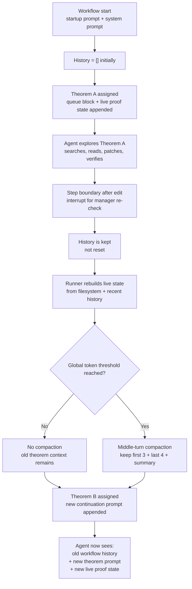
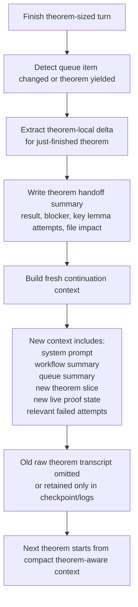

# Autonomous Workflow Context Carryover

Date: 2026-04-21

This note explains why EPFLemma keeps a large context when it moves from one theorem-sized queue item to the next inside the same autonomous workflow run.

Reference run:
- Activity: `/Users/lmilikic/GaussWorkspace/GaussTest/.epflemma/workflow-state/activity/runs/prove-20260421T134949Z-pid9680.jsonl`
- Log: `/Users/lmilikic/GaussWorkspace/GaussTest/.epflemma/workflow-state/runs/prove-20260421T134949Z-pid9680.log`

## Short Answer

There is currently no theorem-level reset.

The managed runner keeps one continuous `history` list for the whole file workflow. When a theorem turn ends, the runner:

1. keeps the accumulated conversation history,
2. rebuilds live proof state from the filesystem and recent history,
3. appends a new continuation prompt for the next queue item,
4. only compacts if the global context threshold is exceeded.

For your RCP GLM route, the model context length is treated as `2,000,000` tokens, and the compaction threshold is `50%`, so auto-compaction does not trigger until roughly `1,000,000` tokens. That is far above the size of a typical theorem handoff. So the next theorem inherits most of the prior theorem's search, failed proof attempts, tool output, and assistant reasoning trail.

## What The Code Does Today

### 1. One workflow run uses one long message history

The autonomous loop in `epflemma_cli/native_runner.py` passes the same `history` back into each continuation:

```py
result = _run_managed_conversation(
    agent,
    user_message=augmented_text,
    system_message=system_prompt,
    conversation_history=history,
    persist_user_message=f"[epflemma-native autonomous continuation #{cycle}]",
)
history = result["messages"]
```

That means cycle `N+1` starts from the full conversation produced by cycle `N`, not from a fresh theorem-local session.

### 2. Theorem-sized yielding does not reset history

When a file edit happens in single-queue-item mode, the runner interrupts the agent after the edit:

```py
agent.interrupt(WORKFLOW_STEP_BOUNDARY_INTERRUPT)
```

This is useful because it yields after a declaration-sized change. But it is only a control-flow boundary, not a context boundary. The full `messages` list is still returned and reused on the next continuation.

### 3. Continuation prompt adds new queue assignment on top of old history

The next cycle builds a fresh prompt from live state:

- `Assigned queue item`
- current blocker
- file prefix / slice
- recent failed attempts for that theorem
- live proof state block

But this prompt is appended to the existing conversation instead of replacing earlier theorem-local exploration.

### 4. Auto-compaction is global, not theorem-aware

Before each continuation, the runner calls:

```py
history, compaction_state = _auto_compact_history(history, agent)
```

That compaction only fires when the global token threshold is crossed.

In `run_agent.py`, the compressor is initialized with:

- `threshold = 0.50`
- `protect_first_n = 3`
- `protect_last_n = 4`

And in `agent/context_compressor.py`, the threshold is:

```py
self.threshold_tokens = int(self.context_length * threshold_percent)
```

For your model route, `get_model_context_length("zai-org/GLM-5.1", base_url="https://inference.rcp.epfl.ch/v1")` resolves to:

- `2,000,000`

So auto-compaction waits until roughly:

- `1,000,000` tokens

That is why theorem-to-theorem transitions do not compact in practice.

### 5. Pruning is shallow even when compaction does not fire

`_prune_history()` only truncates older tool outputs over `2000` chars and preserves the last two user turns fully.

It does not:

- drop old assistant reasoning from finished theorems
- drop old search trajectories for completed theorems
- collapse old theorem-local proof attempts into a theorem summary
- reset the conversation when the queue target changes

So even below the compaction threshold, history grows in a sticky way.

## Evidence From The Observed Run

### Queue transition happened without reset

The run first spent many turns on `amc12a_2021_p19`, then solved `algebra_amgm_sumasqdivbgeqsuma`, then returned to `amc12a_2021_p19` in continuation cycle 2.

The log shows the second cycle started with:

- `Request size: 152 messages, ~130,732 tokens (~522,931 chars)`

The activity JSONL shows:

- `message_count: 118`
- `approx_tokens: 116431`
- `total_chars: 522931`

That is not a fresh theorem-local handoff. It is a large inherited session.

### The new queue item prompt is appended, not isolated

The continuation user message contains:

- `Continue the autonomous workflow`
- `Assigned queue item: amc12a_2021_p19`
- refreshed live proof state

But the same request still includes the entire prior context for:

- earlier searches
- failed proof sketches
- patch history
- file verification output
- the solved `algebra_amgm_sumasqdivbgeqsuma` turn

### The runner intentionally preserves continuity across turns

This is consistent with the design goal of “continue the same managed workflow”, but it is not aligned with theorem-by-theorem isolation.

## Workflow Diagram



## Context Contents By Phase

### Phase 1. Startup

Context includes:

- managed system prompt
- workflow startup prompt
- queue assignment for the first theorem
- live proof state block

### Phase 2. During theorem work

History accumulates:

- assistant reasoning and prose
- tool calls
- tool results
- patch diffs
- verification outputs

This is expected.

### Phase 3. After theorem-sized yield

The runner does:

- rebuild live state
- maybe checkpoint
- maybe compact
- continue

What it does not do:

- clear theorem-local search history
- replace the solved theorem transcript with a compact theorem summary
- start a fresh sub-session for the next theorem

### Phase 4. Next theorem continuation

The next theorem gets:

- all retained old history
- plus a new queue block
- plus a new live proof state block

So the prompt gets semantically refreshed, but not structurally reset.

## Why This Feels Wrong In Practice

For theorem-queue workflows, the model should usually carry forward:

- file state
- queue state
- known blockers
- prior failed attempts for the current theorem
- a compact workflow summary

It usually does not need the full search trace and proof scratchwork of an already-finished or abandoned theorem.

Right now EPFLemma optimizes for whole-workflow continuity, not theorem-local isolation. That makes sense for some long sessions, but it is too sticky for queue-driven Lean proving.

## Current Behavior: Benefits vs Costs

### Benefits

- preserves global continuity
- keeps file-level strategy in view
- retains prior blockers and verification evidence
- avoids forgetting edits that changed downstream queue items

### Costs

- old theorem reasoning pollutes new theorem prompts
- irrelevant search/tool history remains visible
- prompt size grows faster than needed
- queue transitions are not crisp
- theorem-local failures can bias later unrelated theorem work

## What A Better Reset Model Would Look Like

The likely right design is not a full amnesia reset. It is a theorem-aware carry-forward boundary.

### Keep across theorem transitions

- system prompt
- workflow command
- active file
- current queue summary
- compact workflow snapshot
- compact summary of solved theorem outcome
- failed-attempt memory only for the newly assigned theorem
- current file slice / prefix for the new theorem
- latest verification/build status

### Drop or summarize across theorem transitions

- detailed search logs for the previous theorem
- long tool outputs from the previous theorem
- assistant chain-of-thought-like exploration for the previous theorem
- repeated verification output no longer relevant to the new theorem
- patch-by-patch transcript once the resulting file state is already on disk

## Proposed Improved Flow



## Recommendation

The current behavior is working as implemented, but it is not theorem-aware enough.

The main issue is:

- continuation cycles preserve full workflow history unless a huge global token threshold is crossed

The specific design gap is:

- queue-item transitions do not trigger a semantic reset

The practical fix should be:

1. introduce theorem-boundary compaction when the assigned queue item changes or after a theorem-sized yield
2. summarize the just-finished theorem into a short structured handoff
3. carry only queue-global and file-global state into the next theorem
4. keep full raw history only in logs/checkpoints, not in the live prompt by default

## Discussion Questions

1. Should theorem transitions always rebuild from a compact queue-aware handoff, or only after successful verification / blocker declaration?
2. Should failed-attempt history be scoped strictly per theorem and excluded for unrelated declarations?
3. Should queue mode use a much smaller compaction threshold than generic chat mode?
4. Should the next theorem start as a fresh child session with only a managed handoff, instead of reusing the same session history?
