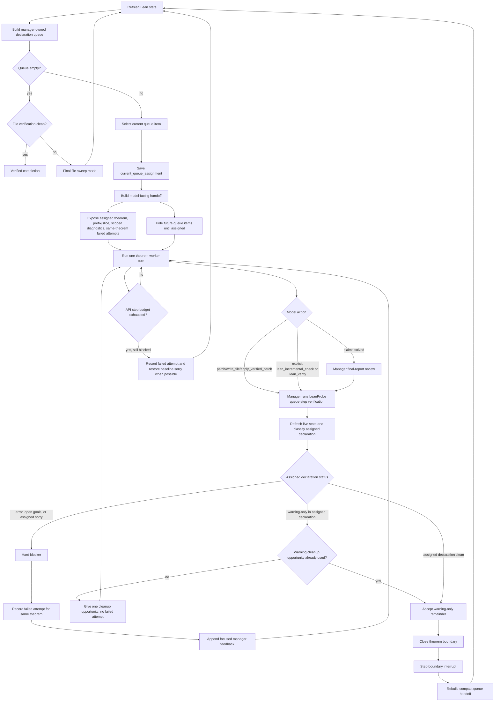

# LeanFlow Product Reference

This reference covers LeanFlow's workflows, skills, providers, runtime
configuration, persistence model, and verification contracts.

LeanFlow is a Lean-first automation shell for proof repair and mathematical
formalization. The installed command is `leanflow`.

The product is optimized for two main jobs:

- `prove`: drive Lean proof repair and completion until the code compiles cleanly
- `formalize`: translate a project-local LaTeX/PDF source document or TeX project directory into statement-verified Lean declarations; `/prove` fills the resulting `sorry`s

Internally, `/prove` and `/autoprove` normalize to the same native workflow, and `/formalize` and `/autoformalize` normalize to the same native workflow. The auto-prefixed forms are compatibility aliases, not separate product surfaces.

It installs as `leanflow`, uses `~/.leanflow` for user-level config, and keeps project-owned workflow state in `.leanflow/`.

LeanFlow runs managed workflows through its internal `leanflow-native` runtime.
Inference can use a Codex OAuth session, direct provider APIs,
OpenAI-compatible endpoints, or local runtimes such as vLLM, Ollama, and
llama.cpp.

## Product Direction

LeanFlow is intentionally Lean-first and automation-first.

- The default shell and workflow UX are built around Lean proving and formalization, not generic assistant chat.
- Proof workflows are judged by strict Lean verification, not by partial progress:
  - explicit successful build
  - clean diagnostics
  - no open goals
  - no `sorry`
- Multi-agent execution exists only as an explicit user-approved mode.
- Agents do not auto-spawn by default.
- When swarm mode is enabled, file locks are used to keep concurrent agents off the same file.

## Skills

LeanFlow ships with a small curated skill core for Lean workflows. Skills are not a side feature here; they are part of how the agent is steered toward proving, diagnostics, formalization, resume, and user-approved swarm behavior.

Skills are the routing layer over the native workflow and worker specs in
`leanflow_specs/`. The specs define the canonical Lean contract; skills select
the relevant contract and tool order for the current workflow state.

Built-in skills:

- `lean-proof-loop`
  - standard proof-repair loop for `prove`
  - emphasizes: inspect diagnostics/goals first, make minimal edits, rebuild, and do not stop until the project is actually verified
- `lean-theorem-queue-worker`
  - single-declaration worker used during file-scoped autonomous proving when the runner has assigned a concrete theorem/lemma queue item
  - emphasizes: stay on the assigned target, use target-scoped failed-attempt history, and hand control back after the declaration is solved or the manager requests a concrete route change
- `lean-diagnostics`
  - focused diagnostic mode for `review`
  - emphasizes: current blockers, open goals, verification state, and project-wide remaining `sorry`
- `lean-formalization`
  - formalization and declaration-building skill for `formalize` and `draft`
  - emphasizes source inspection, blueprint planning, traceable declarations,
    buildable statement drafts, and an explicit handoff of intentional proof
    holes to `prove`
- `lean-search`
  - unified search helper used before editing proofs, covering both local-project context and Mathlib/semantic discovery
  - emphasizes: nearby declarations, imports, naming/style reuse, theorem-name discovery, statement inspection, and reducing proof guessing
- `lean-refactor-golf`
  - refactor / golfing skill for `refactor` and `golf`
  - emphasizes: simplifying proof structure without breaking verification
- `lean-autonomous-swarm`
  - swarm skill used only when you explicitly launch a workflow with `--agents N`
  - emphasizes: file ownership, verifier roles, and strict final verification

### How Skills Are Assigned

There are three ways a skill gets into the agent:

1. Automatic workflow assignment
   - `prove`, `autoprove` -> `lean-proof-loop`
   - `formalize`, `autoformalize`, `draft` -> `lean-formalization`
   - `review` -> `lean-diagnostics`
   - `refactor`, `golf` -> `lean-refactor-golf`
   - `--agents N` on autonomous workflows switches to `lean-autonomous-swarm`
   - for file-scoped autonomous proving with an assigned declaration queue item, the runner temporarily switches from `lean-proof-loop` to `lean-theorem-queue-worker`

2. Manual shell activation
   - `/skill lean-proof-loop`
   - `/skill lean-diagnostics`
   - `/skill reload`
   - direct activation also works via `/<skill-name>`

3. Resume/continuation context
   - the managed runner can carry the active skill through checkpoints, compaction, and autonomous continuation cycles

When a skill is active, its `SKILL.md` content is inserted into the agent prompt as explicit workflow guidance. The prompt builder and `/skills` surface also expose linked workflow-spec metadata, so the agent sees both the routing skill and the underlying spec contract it should follow.

### Skill Install And Override Paths

Skill discovery order is:

- built-in repo skills in `leanflow_skills/`
- user overrides in `~/.leanflow/skills`
- project overrides in `.leanflow/skills`

Precedence is:

- project overrides user
- user overrides built-in

That means you can replace a built-in skill for one machine or one project without editing the shipped repo skill.

Install patterns:

- user-wide skill:
  - create `~/.leanflow/skills/<skill-name>/SKILL.md`
- project-local skill:
  - create `.leanflow/skills/<skill-name>/SKILL.md` inside the Lean project

Example:

```text
~/.leanflow/skills/my-proof-policy/SKILL.md
.leanflow/skills/lean-proof-loop/SKILL.md
```

The second example overrides the built-in `lean-proof-loop` only for that project.

### How The Agent Sees Skills

The agent does not install skills as code plugins. It loads them as prompt-time workflow instructions:

- the skill resolver finds the highest-precedence matching skill
- LeanFlow reads the skill’s `SKILL.md`
- that content is embedded into the agent prompt for the active workflow
- supporting files under `references/`, `templates/`, `scripts/`, and `assets/` stay discoverable through the skill system when needed

Use `/skills` to see what the agent can currently load and where each skill came from.

## Native Workflow Contract

Native Markdown specs are the canonical Lean workflow contract.

Spec roots:

- `leanflow_specs/workflows/`
- `leanflow_specs/workers/`

Workflow specs shipped in the repo:

- `prove`
- `formalize`
- `draft`
- `review`
- `refactor`
- `golf`
- `doctor`
- `search`

Dormant worker specs shipped in the repo:

- `proof-repair`
- `proof-golfer`
- `axiom-eliminator`
- `sorry-filler-deep`

These specs are the source of truth for:

- prompt assembly
- native Lean tool ordering and fallbacks
- doctor/capability reporting
- route decisions
- contract validation in tests

Skills select these specs without duplicating the full operational contract.

For package boundaries and the native execution path, see
[`ARCHITECTURE.md`](../ARCHITECTURE.md).

## What Ships

- `leanflow` CLI with LeanFlow shell branding
- `leanflow-agent` shared agent entrypoint
- Lean workflows:
  - `/draft`
  - `/review`
  - `/refactor`
  - `/golf`
  - `/prove`
  - `/formalize`
  - `/autoprove` -> alias of `/prove`
  - `/autoformalize` -> alias of `/formalize`
- Local runtime commands:
  - `leanflow models local list`
  - `leanflow models local start`
  - `leanflow models local stop`
  - `leanflow models local status`
  - `leanflow models local logs`
  - `leanflow models local use`

## Product Scope

The supported repository surface is limited to the Lean workflow kernel.

Supported product surface:

- LeanFlow shell UX on top of `leanflow`
- Lean proving and formalization workflows
- user-approved multi-agent swarm mode
- file locking for concurrent Lean editing
- curated Lean skill core in `leanflow_skills/`
- provider routing for direct APIs, RCP/custom endpoints, and local runtimes
- managed local runtimes: `vllm`, `ollama`, `llama.cpp`

Removed from the supported product:

- gateway and messaging platforms
- cron/scheduler product surfaces
- browser automation workflow surface
- website/landing page/docs site
- RL/benchmark environment suites
- generic and marketplace-style skill catalogs
- WhatsApp bridge and other non-Lean platform extras

## Name, CLI, and Paths

- Product name: `LeanFlow`
- CLI command: `leanflow`
- State directory: `~/.leanflow`
- Project manifest: `.leanflow/project.yaml`

The interface is styled around EPFL / Lean / AI-for-math work, but the executable name stays `leanflow`.

## Install

Direct local install from the current repo:

```bash
git clone https://github.com/epfl-lara/LeanFlow.git
cd LeanFlow
./scripts/install-internal.sh
```

If you already have the repo checked out locally, just run:

```bash
./scripts/install-internal.sh
```

`./scripts/install.sh` is the Morph/local-template wrapper. Use `./scripts/install-internal.sh` when you want the repo to install its own local CLI wrappers directly.

Default install locations:

- state: `~/.leanflow`
- wrappers: `~/.local/bin/leanflow`, `~/.local/bin/leanflow-agent`
- virtualenv: `./.leanflow-venv`

The installer also checks or wires the external CLI tools used by normal
workflows: `rg` for repository search and Poppler's `pdftotext`, `pdfinfo`, and
`pdfimages` for PDF source inspection.

Custom install locations:

```bash
./scripts/install-internal.sh \
  --leanflow-home "$HOME/.leanflow" \
  --bin-dir "$HOME/.local/bin" \
  --venv-dir "$PWD/.leanflow-venv"
```

## Update

Update by reinstalling from the repo:

```bash
cd LeanFlow
git pull
./scripts/install-internal.sh
```

Sandboxed install:

```bash
./scripts/install-sandbox.sh
```

The sandbox installer runs the normal install, builds the local Docker/Podman
image, and writes an `leanflow-sandbox` wrapper. To upgrade that runtime:

```bash
./scripts/update-sandbox.sh
```

The sandbox runtime copies the active LeanFlow project into a per-run worktree,
mounts only that copy plus sandbox cache/home directories, and exports the final
diff to `~/.leanflow/sandbox/runs/<run-id>/changes.patch`. See
[sandbox-runtime.md](sandbox-runtime.md) for the isolation and patch-export
contract.

## Quick Start

Check the install:

```bash
leanflow --help
leanflow doctor
leanflow doctor env --json
leanflow mcp bootstrap lean
leanflow mcp status --json
leanflow config show
```

Initialize an existing Lean project:

```bash
cd /path/to/lean-project
leanflow project init
leanflow project show
```

Run a workflow:

```bash
leanflow workflow prove Main.lean
leanflow workflow prove Main.lean --provider codex --research
leanflow workflow prove Main.lean --provider codex --research --research-workers 2
leanflow workflow prove Main.lean --provider rcp --model zai-org/GLM-5.2
leanflow workflow prove Main.lean --clean-room --clean-room-label "Benchmark Problem 2"
leanflow workflow prove Main.lean --human-review
leanflow workflow prove Main.lean --agents 3
leanflow workflow prove Main.lean --no-parallel
leanflow workflow formalize docs/paper.tex
```

Monitor a run without coupling the default status path to Docker/Podman
availability:

```bash
leanflow status
leanflow status --verbose  # larger history plus a live sandbox-engine probe
```

## Workflow Example Projects

The repo also carries opt-in Lean workflow projects under `testdata/workflow_projects/`.

These are for manual workflow runs and future targeted integration coverage, not for the default pytest or CI path. `testdata/workflow_projects/ProveDemo` is the proof-repair fixture, and `testdata/workflow_projects/DocFormalizationDemo` is the document-formalization fixture.

Interactive mode:

```bash
leanflow
```

Inside the shell:

```text
/banner
/status
/workflow status
/workflow history
/workflow activity
/workflow log 120
/goals
/diagnostics
/proof-state
/provider
/swarm
/skills
/skill lean-proof-loop
/skill reload
/models local list
/cd path/to/project
/project init
/project create DemoProject --template-source https://github.com/example/lean-template.git
/prove
/prove Main.lean
/prove Main.lean --agents 3
/prove Main.lean --no-parallel
/formalize docs/paper.tex
/doctor
/doctor search --json
/mcp bootstrap lean
/mcp status
/mcp status --json
/config get model.default
/exit
/quit
```

Workflow commands also accept forgiving forms without the leading slash:

```text
prove
prove Main.lean
prove Main.lean --agents 3
prove Main.lean --no-parallel
formalize docs/paper.tex
```

The interactive shell starts with an LeanFlow banner that shows the current route and the main Lean commands you are expected to use.

The bottom toolbar is live workflow context, not decoration. It surfaces:

- current managed workflow phase
- active file and target theorem
- latest build state
- active skill
- latest structured workflow event

The shell also reads persisted managed-workflow state so these commands work across resumed sessions:

- `/workflow status`
- `/workflow history`
- `/workflow activity`
- `/workflow log 120`
- `/goals`
- `/diagnostics`
- `/proof-state`

A newly launched runner publishes `starting` and then `reconciling` before it loads the potentially
expensive checkpoint, plan, queue, and Lean preflight state. These phases carry the new process's
verified ownership identity and heartbeat immediately. Proof fields retained from the prior durable
snapshot remain explicitly marked with `startup_reconciliation_pending: true` until fresh Lean state
replaces them, so startup visibility does not claim that historical mathematical state is current.
The shell status panel labels those retained fields as a prior durable snapshot pending
reconciliation.

`/exit` asks the current project's managed runner to shut down cleanly first and waits briefly
for that exit request to land. Any later direct interrupt requires the live process to match the
per-launch ownership-token fingerprint plus its recorded process-group/session identity. Historical
PID-only records are never signaled, so PID reuse cannot redirect cleanup at an unrelated process.

## Autonomous Lean Behavior

The native runner is designed for Lean automation, not free-form chat.

What the autonomous runner tries to do:

- identify the active Lean file and target declaration
- inspect diagnostics and goals first
- make the smallest useful edit
- rebuild or re-check diagnostics after meaningful edits
- continue until the target is verified or the main statement is authoritatively disproved;
  concrete blockers trigger route changes rather than mathematical stops

What counts as success for `prove`:

1. the relevant Lean code builds successfully
2. diagnostics are clean
3. there are no open goals
4. there are no `sorry` in the active target
5. there are no remaining `sorry` elsewhere in the project outside dependencies

`prove` is intentionally stricter than a local file-only loop: it continues
until the requested scope is clean, not merely until the current theorem looks
finished. `formalize` has a different terminal contract: it produces a
buildable, source-reviewed statement draft with intentional proof holes, then
waits for an explicit `prove` handoff.

### Relentless Proving And Research Mode

Every rejected `prove`/`autoprove` turn is followed by a persistence-coach message. The small
manager model can acknowledge verified progress and reinforce the route already chosen by the
orchestrator, but cannot choose a route, launch work, alter verification, or stop the campaign.
`LEANFLOW_MANAGER_LLM_MODE=off|dark|live` controls the model call only; a deterministic positive
fallback gives complete coach coverage when the model is disabled or unavailable. The optional
model request defaults to a five-second parent-enforced wall-clock deadline and is always capped at
ten seconds; `LEANFLOW_MANAGER_NUDGE_TIMEOUT_S` can lower or tune that bounded deadline without
allowing the message-only coach to hold the foreground proof loop for a general model timeout.

`--research` promotes the optional redesign components into one complete profile:

```bash
leanflow workflow prove Main.lean --provider codex --research
leanflow workflow prove Main.lean --provider codex --research --research-workers 2
```

The default is a foreground prover plus capacity for two live background research actors.
Process-isolated jobs and in-process planner lanes share those two actor slots for their full
conversation lifetime; nested model helpers retain their actor's slot. Foreground prover,
manager, orchestrator, and planner-synthesis control turns remain outside the background pool.
If all slots are occupied, a planner lane records `capacity-deferred` after a short bounded wait
and the route is retried at the next safe orchestration boundary instead of freezing the prover.
Once a planner route is pending, portfolio maintenance continues harvesting completed findings but
temporarily leaves the next freed actor slot unfilled. This gives the planner lane a bounded path to
capacity instead of letting immediate replacement jobs starve it. The same harvest tick records one
assignment-scoped replacement obligation in durable workflow state. Repeated planner heartbeats do
not duplicate it, the next refill-enabled maintenance tick fulfills it after capacity is released,
and a campaign-epoch refresh immediately launches a distinct replacement portfolio when that refresh
intervenes first. Capacity reservation can delay a background launch, but cannot discard it or end the
mathematical campaign.
Synchronous manager, orchestrator, verifier, and planner-synthesis text turns run in a short-lived
isolated process. Their configured timeout is a parent-enforced wall-clock deadline: an overrun or
signal kills and reaps the worker process group, then the deterministic control-plane fallback
continues instead of leaving the main loop blocked inside a provider SDK. Worker and parent error
paths apply bounded credential redaction unconditionally before telemetry persistence.
Research-mode orchestrator advice has a tighter foreground contract: its user prompt is a
target-scoped 12,000-character digest that preserves the assigned declaration and error-bearing
diagnostics, with per-section hashes and omission counts for bounded graph, route, finding, plan,
and phase histories. The isolated consult may wait at most twenty seconds (the normal timeout
setting may lower this ceiling), and its first timeout opens a project-local two-minute circuit.
While that circuit is open the deterministic orchestrator route is used immediately; a later
successful half-open call closes it. The LLM remains an optional route refinement and cannot
starve proving progress.
Each worker receives a fresh process-ownership token. The dispatch ledger stores only its hash
with the worker's process-group/session identity, and timeout or cancellation signals are sent only
after that exact identity is revalidated; stale PID-only ledger entries fail closed.
The async launcher also persists a random launch nonce and a capacity-counted `deployed` reservation
before it writes the worker spec or calls `Popen`. It publishes `running` only after `Popen` returns
an exact PID/group/session/token identity. A per-job thread/POSIX sidecar lock spans reservation or
recovery rotation, spec publication, `Popen`, and the running-state compare-and-swap. A delayed
launcher rechecks the ledger nonce under that lock before it may write or spawn. Both parent and
child publish a nonce-bound identity receipt for the launch/ledger-commit crash window. Retry
rotation writes the new shared spec fence before committing its ledger nonce, so a crash between
those writes rejects stale work. Same-process recovery adopts a live exact identity, while a new
runner PID exact-terminates the old parent-guarded worker and retries with a new nonce. An incomplete
handshake is likewise retried after a short grace period. The atomically
replaced job-global spec is the authoritative current-nonce fence and every worker reads it again
under the same sidecar lock immediately before backend entry, then synchronously verifies that its
expected parent still exists. A new runner waits for the old exact process boundary to disappear
after bounded TERM/KILL escalation before rotating the nonce or starting replacement provider work;
permission or transient identity lookup failures keep the launch reserved and fail closed. Modern identity and result filenames
contain a safe digest of their launch nonce, and completed payloads must also carry that nonce. A
delayed old child therefore cannot overwrite or complete a newer launch. Shared identity/result
paths remain only for legacy non-nonce ledger entries. Portfolio ticks poll both launching and
running entries before deciding
whether a background lane needs refill.
`--research-workers N` implies research. `--no-parallel` launches no process workers and keeps
planner research sequential through one synchronous actor slot. `LEANFLOW_RESEARCH_MODE=1` remains
the environment-compatible form. The CLI flags are authoritative: inherited feature-disable values
such as `LEANFLOW_ORCHESTRATOR_ENABLED=0` cannot silently turn an explicit research request into a
partial profile. Environment-only activation applies the complete defaults while preserving
deliberate per-feature overrides for advanced diagnostics. In either form, an unavailable or
disabled orchestrator cannot make `stalled`, `blocked`, `budget-breakpoint`, or `parked` terminal.

`--human-review` is an explicit opt-in. It permits the orchestrator to park a
scope-ambiguous or statement-fidelity-suspect goal and add a question to the
human-review queue. Without the flag, LeanFlow preserves the source statement,
records the concern, and selects another autonomous planning route.

External research is enabled by default. `web_search` routes current/documentation queries to the
general web and formal-mathematics queries across arXiv, Semantic Scholar, Crossref, Sourcegraph,
and the general web. Independent provider requests run concurrently with bounded provider
timeouts; a throttled or timed-out backend is reported but cannot discard surviving results.
`search_depth=deep` plus up to three `alternate_queries` provides a bounded multi-formulation
portfolio in one tool call. The merge canonicalizes arXiv/DOI/URL duplicates, ranks query overlap,
diversifies sources, assigns stable `source_id` values, preserves `matched_queries`, and returns
per-provider status and maximum latency for the workflow log. Tavily and Exa are optional reliable
general-web providers (Tavily has precedence and Exa is its keyed fallback); Semantic Scholar and
Jina keys improve their respective paper/read quotas. The keyless route tries DuckDuckGo and then
Bing, reporting the failed branch even when the second engine succeeds. The Bing fallback rejects
generic pages that fail entity-term coverage and performs at most one cleaner retry. An empty
software/documentation search then tries GitHub's public repository API and returns clone metadata;
successful GitHub query payloads are cached for five minutes to conserve its search quota.
Clean-room mode skips that request before network access. An empty portfolio returns
`status=no_results`, `success=false`, and `retryable=true`, so the agent cannot mistake a
reachable-but-unhelpful backend for completed research.
Search snippets are discovery only: planner and deep-search workers must inspect promising primary
sources with `web_fetch`, clone concrete public proof developments when allowed, and retain the
queries, providers, sources read, and rejected branches before they may report research exhausted.

For a clean-room benchmark, prefer the workflow-scoped
`--clean-room` flag and provide additional task spellings with repeatable
`--clean-room-label VALUE` options when the target path is not sufficient.
LeanFlow derives path, file-name, and stem labels automatically. The launch
boundary cannot be weakened by dispatch-worker environment metadata. The
environment-compatible form is `LEANFLOW_DISABLE_REPOSITORY_RESEARCH=1`.
Repository cloning,
repository-host web results and fetches, Sourcegraph code search, and Git/repository-host terminal
commands are then denied. Model file tools are also confined to `LEANFLOW_PROJECT_ROOT`, with
canonical path and symlink checks. On the regular local backend the terminal is
reduced to an audited, read-only, project-confined diagnostic surface; sandbox
runs additionally receive the container's host-filesystem boundary.
During a managed theorem turn, clean-room writes are limited to the assigned
Lean file, its exact `<Stem>Helpers.lean` companion, and text/JSON state under
`.leanflow/workflow-state`; ad hoc scripts and unrelated project artifacts are
rejected before they are written. This preserves modular Lean development and
durable plans/graphs without contaminating the benchmark.
This policy is intentionally off by default: normal open-problem campaigns keep
repository research because reusing public formalizations can save substantial
time.

To prohibit prior solutions while retaining general research, also set
`LEANFLOW_DISABLE_SOLUTION_RESEARCH=1` and provide pipe-separated task spellings
through `LEANFLOW_CLEAN_ROOM_TASK_LABELS` (for example,
`Benchmark Problem 6|BP6`). Queries, results, URLs, and terminal commands
that name the task then fail closed. Sandbox clean-room runs also deny Git
transports process-wide and reuse only read-only third-party `.lake/packages`;
project build output is not mounted.

Sandbox builds use `python:3.12-bookworm` by default. When that registry is unavailable and a
compatible Debian image already exists locally, set `LEANFLOW_SANDBOX_BASE_IMAGE` to its local tag;
the image build installs Python and reuses an existing Elan installation when present.
An explicitly `--provider codex` sandbox mounts only the host Codex `auth.json` and `config.toml`
read-only; it does not mount the rest of `CODEX_HOME`.

Canonical `lake env lean FILE` gates normally use a 120-second subprocess timeout. Research mode
raises that gate to a deterministic 900-second cold-start floor, matching the incremental checker;
otherwise a kernel-valid edit in a large fixture can be written and then labeled `check_failed`
solely because the broad file check has a shorter budget. `LEANFLOW_LEAN_COMMAND_TIMEOUT_S` is a
bounded expert override, but it cannot lower the research floor. Set
`LEANFLOW_LEAN_COMMAND_HARD_TIMEOUT_S` when one managed run needs an absolute subprocess cap; the
hard cap remains authoritative in research mode and does not change the default policy.

Research keeps the foreground `lean-lsp` diagnostics, goals, remote Loogle, and native search
fallbacks, but disables that server's separate local Loogle index by default. This avoids retaining
another multi-gigabyte process throughout a full campaign. Set
`LEANFLOW_RESEARCH_LOCAL_LOOGLE=1` to restore local Loogle for an explicitly
memory-provisioned research run. Non-research behavior is unchanged.

Research mode enables plan/graph state, premise retrieval, breakpoints, both orchestrator layers,
fidelity auditing, planner lanes, background dispatch, negation probes, reports, learnings, and
coaching. It launches a grounding job at scope entry. After two rejected proof attempts, the
default two-worker portfolio is deep-search plus empirical work. A semantically saturated empirical
lane rotates first to negation; an inconclusive or spent negation lane can then rotate to the
dedicated decomposition archetype without increasing capacity. Completed findings are consumed once
and replacement objectives are assignment-scoped and deduplicated while the goal remains unresolved.
Foreground discovery is also bounded per assigned declaration. Lean/web search,
file-pattern search, and source reads share one budget; once it is spent, those
tools are fenced until the model synthesizes the preserved evidence or the
outer orchestrator starts a distinct construction route. Proof edits, exact
Lean checks, and explicit helper decomposition remain available.

Background decomposition is process-isolated and proposal-only. Its normalized
`decomposition_report` contains exact source references, source-backed subgoal statements, and
source-backed `depends_on`/`split_of` dependency proposals. Unbacked or malformed proposals are
downgraded deterministically. The child cannot write Lean files, `plan.md`, or `blueprint.json`, and
always returns an empty state delta; only the parent may review and materialize a proposal through
the ordinary fidelity and Lean verification gates.

Findings that the deterministic semantic audit marks duplicate, subsumed, or otherwise ineligible
are delivered as `EVIDENCE_ONLY`, not as suggested proof work. Their explicit counterexamples and
route exclusions remain visible, while candidate code, helper outlines, objectives, target deltas,
and proof shapes are suppressed before prompt truncation. They cannot promote a queue target, but
they retain normal one-shot delivery receipts so research backlogs continue to drain.

Mathematical novelty is intentionally weaker than foreground actionability. After two rejected proof
shapes, a new congruence or singleton finding that explicitly covers only a strict subcase and leaves
the terminal target unresolved is also `EVIDENCE_ONLY` unless it carries an exact target-closing
checked replacement. The result stays in durable semantic knowledge, but it cannot instruct an edit,
raise queue priority, or seed recursive evidence-to-helper/audit work. This prevents an endless
finite-sieve campaign in which each fresh modulus is technically novel but never approaches an
exhaustive proof.

Epoch rollover is crash-consistent across both foreground and background work. Its durable token
keeps the distinct non-direct route obligation open until a matching managed turn actually returns;
failed scope consultations and provider pauses retry it instead of accepting a stale route. A paired
worker-refresh record is replayed by portfolio maintenance before refill, harvesting successful
results and retiring only jobs from an older epoch.

Foreground route admission is semantic across the complete no-progress campaign, not merely
label- or epoch-based. LeanFlow persists a provenance-free identity for the exact theorem, strategy
family, target hypothesis, and proof shape. Reworded encouragement, generation counters, worker ids,
timestamps, and route hashes cannot repeat an already-spent intent. A concrete new hypothesis or
proof shape remains admissible; otherwise admission rotates to another viable route family. When all
families are spent, the internal `refresh-portfolio` action checkpoints the negative evidence and
rolls the epoch/worker portfolio without calling the prover, parking the theorem, or recording a
mathematical outcome. It is reserved through the crash-durable in-flight marker, not the fresh
executable-route token, and retires immediately after the rollover request is checkpointed; a crash
before application replays that exact action once without another route charge. Kernel-gated graph
progress is the only event that clears this semantic ledger.

Consumed job results remain losslessly owned by the dispatch ledger. LeanFlow materializes only the
current theorem's due evidence into a 32-finding foreground window. Safe same-file split ancestors
receive at most one three-finding foreground batch, while exact-target findings take priority for the
remaining slots. A target change archives inactive prompt copies only after exact ledger/hash
validation; malformed or mismatched evidence is retained in quarantine. Delivery receipts are scoped
to the exact `(job, foreground target)` pair, so a split child's acknowledgement cannot hide evidence
when its parent is reopened. Larger backlogs page forward as receipts free slots, but inherited history
cannot fill the window and block research refill for a new child scope.

An exact evidence-to-helper follow-up reserves its source finding from foreground delivery while
active. After termination, only an actionable, schema-valid exact helper or replacement keeps the
source reserved while awaiting harvest; every other result releases it. A materialized actionable
candidate is delivered first and couples its receipt with the source receipt after the next assistant
response, avoiding duplicate synthesis without weakening crash recovery.

Planner empirical work is a bounded pilot, not an exhaustive foreground search: its prompt permits
at most 12 deliberately selected small cases, and the runtime permits at most two
`empirical_compute` calls with an eight-second timeout each. The lane has read/check-only Lean tools
and no terminal or project-mutation authority. While a synchronous planner wave runs, the parent
process continues polling the research portfolio in harvest-only mode. Finished workers are reaped
and their findings consumed, but their slots remain reserved until the planner wave finishes. Each
resulting vacancy is checkpointed as a deduplicated replacement intent and is fulfilled once on
planner release or immediately after an intervening epoch refresh. Planner lanes are chunked to the
shared actor capacity, and capacity deferral is journaled instead of constructing extra waiting
agents.

Background empirical dispatch workers use a separate `empirical_compute` tool for exact integer and
`Fraction` experiments. It is exposed only when the isolated worker's JobSpec archetype is
`empirical`; general terminal Python remains denied for every scratch worker. Each computation runs
foreground-only in a fresh subprocess and ephemeral directory with a restricted arithmetic AST,
minimal environment, 1–8 second hard timeout, and CPU, memory, source, and output limits. Project
inspection remains available through project-confined read/check tools, while writes, renames,
unlinks, process spawning, dynamic imports, background execution, and PTYs have no compute surface.
Scratch dispatch workers receive no terminal tool. Their Lean surface preserves deterministic
inspection and inline checking but excludes patch authority and nested LLM advisor calls.

An LLM route remains advisory even before Lean proof checking begins. A narrow deterministic
arithmetic preflight expands recorded affine aliases and rejects plainly false affine identities or
divisibility claims when a concrete modular countercheck is available. The rejected claim and
counterevidence are recorded as failed-route evidence, and the deterministic orchestrator floor
immediately supplies the route instead. Nonlinear, ambiguous, or otherwise unsupported mathematics
fails open to ordinary probing and eventual Lean verification; this check is not a general theorem
prover and cannot accept a proof.

Graph names are not dependency evidence. The routing prompt separates the current target's explicit
dependency edges from the campaign-global frontier, labels same-file proved declarations by
deterministic conclusion-shape compatibility, and rejects structured graph-identity relabeling:
`target_node` must be the active assignment, and a newly stated declaration cannot reuse an
incompatible existing graph name. Rationale and probes may cite proved helpers with different
conclusions; only Lean elaboration and the kernel gate decide whether their use closes a branch.
The campaign-global frontier remains scheduling inventory, not a dependency claim.

Hard ceilings are model-context boundaries, not mathematical limits. At 120 managed cycles, four
route decisions without graph progress, or context pressure, LeanFlow checkpoints the campaign and
starts a fresh epoch under the same campaign ID. Verified helpers, failed proof shapes, findings,
the graph, and the job ledger survive the rollover. The fresh epoch must start a distinct
non-direct strategy before direct proving resumes. Just-completed worker results are harvested,
still-open old-epoch workers are retired, and the next portfolio tick refills distinct routes.
Semantic-cooldown evidence survives the rollover. Only when ordinary uncooled selection cannot
fill configured capacity may refill relax a cooldown produced in an older epoch, and the
history-wide selector must still produce a distinct route objective and signature. Same-epoch
cooldowns remain authoritative.

Only the deterministic Lean gate can accept a proof. A scratch negation is evidence only; it must
be rerun against the current declaration with a matching signature/source revision, no `sorry`,
and the standard-axiom allowlist before it is promoted. Only promoted negation of the main goal
returns `disproved`; a false campaign-created sublemma retracts only the exactly owned helper,
restores the parent declaration from durable pre-edit provenance, and triggers replanning. The
cleanup fails closed and quarantines stale or user-edited source instead of deleting an ambiguous
declaration; valid negation helpers/evidence survive unless their own creation transaction proves
they belonged to the rejected decomposition.
Promotion writes are crash-consistent: full evidence is durable before graph falsity, and startup
replays or quarantines any pending transaction. A restarted `disproved` campaign reruns the exact
evidence before constructing a provider; current evidence exits `3`, while stale source, signature,
or axiom evidence is quarantined and the theorem resumes.

Headless outcome codes are truthful:

- `0` — requested scope verified
- `3` — main statement authoritatively disproved
- `2` — unresolved but checkpointed/resumable pause, including infrastructure pause or early exit
- `1` — configuration/runtime failure before a valid campaign starts
- `130` — signal interruption

An unresolved requested scope can never exit `0`.
Provider/API infrastructure pauses force a deterministic, provider-free filesystem checkpoint
after owned workers quiesce and before file locks are released, so an edit completed immediately
before provider failure is present in the exit-`2` resume handoff. Ordinary transient failures use
three managed 5/15/45-second backoffs. If the provider client exhausts its complete inner retry
window, the manager retains the same unfinished turn and resumes it indefinitely at a quiet,
at-most-60-second cadence; a provider-owned account reset time remains a durable infrastructure
pause and is never hammered by this retry path.
Signal exit `130` uses the same post-quiescence ordering and refreshes the current durable queue
assignment plus source-derived `sorry` counts before writing status and checkpoint metadata; it does
not start a new Lean or provider process during cleanup.

### Document Formalization

`/formalize` and `/autoformalize` require a project-local `.tex` source, `.pdf` source, or directory containing a TeX project. They remain the same workflow; `autoformalize` is only a compatibility alias.

The resolver prepares a document formalization workspace before the native runner starts:

- source-document preflight manifest under `.leanflow/workflow-state/formalization/`
- bounded extracted-text cache
- Markdown planner blueprint
- generated supplemental blueprint skill under `.leanflow/skills/`
- active Lean target file for drafted declarations
- original request metadata, selected source document metadata, and deterministic TeX project discovery metadata when the user provided a directory

`/prove SomeFile.lean` auto-attaches that generated blueprint skill when the file has a nearby `Blueprint.md`, so prover turns can recover the source map after context compaction. Any workflow can also receive extra persistent guidance with `--additional-skill path/to/SKILL.md`.
- startup context that tells the drafting agent to plan definitions, lemmas, theorem splits, source comments, source pointers, and statement-fidelity checks before proof repair
- an automatic independent statement/source verifier pass once the draft is otherwise ready and only approval statuses are missing

The deterministic preflight is intentionally modest, but it recognizes common math-paper structure. LaTeX documents get sections, labels, references, citations, theorem-like blocks, and adjacent proof excerpts extracted. The theorem scanner covers standard environments, custom `\newtheorem` environments, `thmtools` `\declaretheorem`, `mdframed` `\newmdtheoremenv` / `\mdtheorem`, Springer `\spnewtheorem`, `tcolorbox` `\newtcbtheorem`, theorem-like `\newenvironment` names, and plain-TeX `\profess...\endprofess` blocks. Directory inputs first select a main TeX entrypoint, collect included `.tex` files, bibliography files, local assets, PDFs, figures, and TeX support files, and reject ambiguous roots with an explicit error. PDFs use installed local tools such as `pdftotext`, `pdfinfo`, and `pdfimages` when available, and record degraded extraction reasons when they are not. The planner agent can then use the normal file, terminal, web, and Lean tools to inspect the document more deeply, pull referenced material, and draft Lean files with `sorry`. The independent verifier then checks the source fidelity and marks approved blueprint entries. When that gate passes, the formalizer gets one final generated-file organization pass, exits, and proof filling waits for an explicit user-run `/prove`.

Expected document-prep completion is a buildable statement/source-approved draft that may still contain intentional `sorry`s. Proof filling is the next phase: it starts only when the user explicitly runs `/prove SomeFile.lean` or `/prove` after reviewing the generated formalization, and it is not part of judging whether the source formalization draft itself is ready.

LeanFlow writes managed workflow status, activity, checkpoints, file locks, and the full latest managed runner log into the active project’s `.leanflow/workflow-state/` directory by default so long runs stay next to the Lean repo you are debugging.

Workflow state also includes structured capability snapshots and route decisions in
`.leanflow/workflow-state/outcomes.jsonl`, so resumed runs can reuse prior
blocker classification instead of starting blind.

### Project-Scoped `/prove`

`/prove SomeFile.lean` remains the direct file-scoped proof-repair workflow. `/prove` with no Lean file is the project-scoped manager workflow.

The project prove manager pipeline is:

1. Detect that the command is `prove` and has no explicit `.lean` argument.
2. Scan project Lean files for remaining `sorry` placeholders.
3. Build one candidate record per file with relative file label, absolute path, module name, `sorry_count`, `line_count`, declaration count, pending declaration names, theorem excerpts, hint/example counts, theorem-difficulty scores, candidate-to-candidate import/dependent counts, project-wide import/dependent counts, and import count.
4. Include source context in the planner payload: full source for small files, and selected headers, imports, hints, checked lemmas, and pending theorem excerpts for larger files.
5. Compute a deterministic fallback order: files with more unresolved candidate files depending on them first, then files with fewer unresolved candidate-file dependencies of their own, then project-wide downstream importance, lower theorem-difficulty score, lower first-pending-declaration difficulty, fewer `sorry` placeholders, shorter files, fewer declarations, and path label as the stable tie-breaker.
6. Ask the configured LLM to rank the bounded candidate list using the same policy: dependency importance, theorem difficulty, actual source context, local hints/examples, and length.
7. Sanitize the LLM output so only known candidate labels survive, append any missing fallback files, and keep deterministic dependency/difficulty buckets as guardrails around the model order.
8. Persist the resulting queue and assign the first file by setting the native active file.
9. Hand execution to the existing file-scoped theorem queue, exactly as if the user had run `/prove SomeFile.lean`.
10. When that file verifies and other project files still contain `sorry`, mark the file complete, refresh the queue against the current filesystem, and assign the next file.

This keeps the manager responsible for file order only. The existing theorem queue remains responsible for theorem-level repair, diagnostics, failed-attempt history, incremental verification, final file sweeps, and blocker handling.

Parallel proof-editing agents are disabled by default. The manager assigns one file at a time unless
the user explicitly starts a swarm workflow with an agent-count flag such as `--agents 3`.
Research workers are a separate scratch/deliverable portfolio enabled only by `--research`; the
parent remains the single writer for shared plan and graph state.

### Logging And Inspection

Project prove-manager state is visible in the same surfaces as other managed workflows:

- `/workflow status` reads `.leanflow/workflow-state/live_status.json`
- `/workflow activity` reads the current structured JSONL events under
  `.leanflow/workflow-state/activity/runs/` plus bounded historical tails from
  `.leanflow/workflow-state/activity/historical-runs/`, indexed by
  `.leanflow/workflow-state/activity/historical-summary.json`
- `/workflow log 120` tails the saved raw runner transcript from `.leanflow/workflow-state/latest-run.log` or the timestamped file under `.leanflow/workflow-state/runs/`
- `/proof-state` includes the live proof-state message that is also sent back into autonomous continuation prompts

When living plan state is enabled, prover and research-agent file reads of
`.leanflow/workflow-state/plan.md` return a bounded generated view plus the existing canonical
`## Notes` append anchor; its historical body stays hidden and cannot be paginated. The
deterministic queue assignment and current Lean source/kernel diagnostics—not copied Notes
inventories or stored declaration bodies—remain the
authority. Raw model-facing reads of `summary.json` and `blueprint.json` are also rejected: these
machine snapshots can contain large historical ledgers and stale declaration bodies, while their
bounded graph and finding digests are already injected into managed prompts. Operators can inspect
the raw artifacts only by explicitly enabling
`LEANFLOW_DIAGNOSTIC_FILE_ACCESS=1`.

For fileless `/prove`, `live_status.json` includes:

- `project_prove_manager`
- `project_prove_file_queue`
- `project_prove_completed_files`
- `project_prove_plan_source`
- `project_prove_plan_reason`
- the normal active-file, target theorem, declaration queue, diagnostics, goals, build, route, checkpoint, and model/provider fields

The structured activity stream records manager events suitable for detailed inspection and offline trace curation:

- `project-prove-file-queue-planned`: candidate metrics, final file order, plan source, and plan reason
- `project-prove-file-assigned`: assigned file, absolute path, remaining queue, plan source, and plan reason
- `project-prove-file-queue-empty`: no project files with `sorry` were found
- `project-prove-file-queue-complete`: the project prove queue has no remaining candidate files

Those events sit alongside the existing theorem-level and runner-level events:

- `queue-item-assigned`
- `manager-incremental-warmup`
- `assistant-plan`
- `tool-start`
- `tool-result`
- `autonomous-followup`
- `runner-start` / `runner-exit`

The structured activity feed is the right source for programmatic inspection and training-data curation because it preserves event types and details as JSON. The raw workflow log is the right source when a human needs the chronological transcript, provider previews, tool output head/tail, token usage, and cost estimates. Preview sizes are bounded and configurable through `logging.preview_lines`, `logging.preview_chars`, `logging.tool_output_head_lines`, `logging.tool_output_tail_lines`, and `logging.activity_preview_chars`.

Long campaigns do not keep every completed run on the status hot path. On the next native startup,
LeanFlow streams each closed, non-current run and its eligible mirrored agent stream into
`activity/archive/` as checksum-verified gzip evidence. The original JSONL bytes remain recoverable;
the small `historical-summary.json` evidence index points to per-run JSONL shards under
`historical-runs/` that retain exact agent ancestry, run scope, lifecycle state, API/tool counters,
and bounded recent previews. Status streams one agent summary at a time instead of materializing the
historical payload. A live parent/worker identity prevents archival. The transaction is retryable
across archive, shard, index, and unlink crash boundaries, and ordinary status commands never
decompress cold evidence.

The verification loop is intentionally LeanProbe-first for exact theorem checks:

- use LSP diagnostics and proof goals to inspect state, then LeanProbe to check exact candidates
- for ordered same-file theorem-queue turns, use `lean_incremental_check(check_target)` as the primary queue-step verifier; it is backed by LeanProbe, keeps a LeanInteract server warm, reuses header/import state, and checks only the assigned declaration chunk
- atomic patch verification uses `lean_incremental_check(check_file)`, which replays changed declarations through the same warm per-file cache and permits an intentional assigned `sorry` while rejecting elaboration errors
- keep the canonical `lake env lean <file>` path for final file/project sweeps, explicit canonical checks, and recovery when LeanProbe is unavailable or its session cannot be rebuilt
- the queue manager performs controlled LeanProbe warmup with `prepare_file` when a theorem assignment is created or changes, so patch verification can reuse the warmed server
- the foreground prover retains that incremental session between calls; dispatch workers reclaim their private sessions after each admitted call, and an explicit Lake gate closes the foreground session before starting another Lean process
- agents use `lean_incremental_check` or `lean_verify` for theorem-queue verification so the manager can classify the assigned declaration; direct terminal `lean`, `lake env lean`, and `lake build` checks are rejected during managed theorem turns, while the manager retains the canonical fallback when the incremental backend is broken
- do not treat `lake build`, `grep`, `head`, or truncated output as proof that an assigned theorem is clean
- outside those theorem-scoped turns, avoid repeated `lake env lean <file>` checks because they are slow on large imports
- prefer a focused `lake build <Module>` when the active file is close to clean
- reserve full-project `lake build` for milestone verification and final success checks

Managed automation backends are intentionally treated as optional infrastructure behind the native Lean tools, not as authoritative proof state. When an automation backend misses a declaration that the local file queue can already see, LeanFlow records the backend miss in `degraded_reasons`, degrades cleanly, and continues with local source context instead of stalling the run.

The inspection split is intentional:

- `/workflow activity` is the structured step feed: API calls, assistant plans, tool starts, resumes, checkpoints, and autonomous follow-ups
- `/workflow log 120` is the raw saved runner transcript when you want the exact command/tool chronology that scrolled by during execution
- workflow logs include API-step separators, bounded prompt/assistant/reasoning previews, token usage, and cost estimates when provider pricing metadata is known
- long multiline tool outputs keep both the head and tail instead of only the start
- those preview limits are configurable through `logging.preview_lines`, `logging.preview_chars`, `logging.tool_output_head_lines`, `logging.tool_output_tail_lines`, and `logging.activity_preview_chars`

## Native Lean Tool Surface

LeanFlow exposes a typed Lean tool surface through the `lean`,
`leanflow-native`, and `leanflow-native-swarm` toolsets.

- `lean_capabilities`
  - probe project validity, Lean/Lake/Elan binaries, MCP/LSP tools, search providers, helper availability, worker availability, and degraded-mode reasons
- `lean_inspect`
  - return structured Lean state for a file: diagnostics, goals, `sorry` counts, blocker classification, queue candidates, and the current capability snapshot
- `lean_verify`
  - run the canonical verification ladder in `file_exact`, `module`, or `project` mode
- `lean_incremental_check`
  - run the fast LeanProbe/LeanInteract-backed verifier for ordered same-file theorem queues
  - `prepare_file` warms imports/header and optionally advances cached environments to a target declaration
  - `check_target` verifies the assigned declaration or replacement chunk with `allow_sorry=False`
  - `include_axiom_profile=true` embeds marker-bound transitive axiom evidence in the same exact
    target check; managed assigned-target replacements enable it automatically
  - foreground `check_helper` uses LeanProbe for fast elaboration feedback; adding
    `include_axiom_profile=true` switches to the one-shot exact-project Lake harness and requires a
    complete allowed-axiom profile before model-authored insertion
  - dispatch research workers always use that exact helper harness instead of retaining LeanProbe;
    it keeps the exact pre-anchor source, rejects placeholders and disallowed axioms, and always
    requires the parent recheck
  - staging a canonical worker-checked helper creates a durable exact-assignment action record;
    the parent rechecks it before orchestration, fences one immediate insertion opportunity, and
    retires it only after the ordinary current-source helper gate banks it. Merely acknowledging
    the research prompt is not action, and operational recheck failures remain resumable
  - `feedback` returns diagnostics and optional tactic/proof-state annotations for repair prompts
  - default usage for queue progress:
    - `lean_incremental_check(file_path="Demo/Main.lean", theorem_id="my_theorem", action="check_target")`
    - read `ok`, `valid_without_sorry`, `has_errors`, `has_sorry`, `messages`, `elapsed_s`, and `cache`
  - richer repair usage:
    - set `include_tactics=true`, or use `action="feedback"`, when diagnostics are not enough and the model needs intermediate tactic states
    - inspect `tactics[*].tactic`, `tactics[*].goals`, `tactics[*].proof_state`, `tactics[*].file_start`, `messages[*].file_start`, and `feedback_lean`
    - `feedback_lean` is the model-readable version of the current declaration with inserted feedback comments; use it to repair the proof at the exact failing line
    - failures automatically try to rerun with tactic collection when possible, so blocked proofs usually return richer context without slowing successful checks
  - trust it for queue-step validity when LeanProbe is available, the project-local REPL matches the current toolchain, the cached environment was built from current file content up to the target, and the checked chunk exactly matches the current declaration replacement
  - use `lean_verify` instead for final sweeps, unavailable/crashed/stale LeanProbe sessions, header/import/earlier-declaration edits, non-ordered queues, or explicit canonical checks
- `lean_search`
  - search in `auto`, `local`, `semantic`, `type-pattern`, or `natural-language` mode
  - prefers MCP/LSP-backed providers first and falls back to local `rg`/Mathlib search with explicit provider provenance and degraded reasons
  - managed file-scoped proving marks confirmed later same-file declarations as source-order
    inaccessible using the current disk declaration index; imported, prior, and ambiguous results
    remain in the usable result list
- `lean_proof_context`
  - theorem-context retrieval from the managed automation backend: theorem statement, original proof text, hypotheses, in-scope names, namespace, and similar proofs
  - this is not a replacement for `lean_inspect` goals
  - when the active file already contains the target declaration, LeanFlow first stabilizes lookup from the local declaration range before asking the backend for richer context
  - if the proof-auto backend reports `theorem_not_found` or another backend-side context failure, LeanFlow falls back to a local declaration-slice context instead of pretending the backend succeeded
  - a theorem-lookup miss does not disable proof-auto for the rest of the run; LeanFlow only sticky-disables proof-auto after transport or systemic backend failures
- `lean_multi_attempt`
  - screen 2-6 concrete tactic candidates at one proof location through the MCP backend
- `lean_auto_search`
  - ask the managed automation backend for one theorem-local automated proof candidate after proof context or concrete local evidence exists
- `apply_verified_patch`
  - compatibility path for one atomic Lean patch, pre-edit checkpoint, and immediate verification payload
  - in managed queue workflows, successful `patch` and `write_file` edits are already verified by the manager before the queue advances
- `lean_sorries`
  - list remaining `sorry` findings across a project or a single file with declaration names and line numbers
- `lean_axioms`
  - run a best-effort `#print axioms` check for one declaration and report `axioms`, `custom_axioms`, `classical`, and `choice`
- `lean_reasoning_help` / `lean_decompose_helpers`
  - request advisory mathematical strategy or a structured helper split without granting either
    advisor proof or stopping authority
  - the decomposition `timeout_s` is one whole-request deadline shared by the advisor and all
    subsequent Lean skeleton checks; an inner research cold-start floor cannot extend it
## Theorem-By-Theorem Proving Loop

For file-scoped autonomous workflows (`prove` / `formalize` with an active Lean file), LeanFlow drives the agent one declaration at a time instead of letting it roam the whole file. The runner owns the queue; the agent only owns the current assignment.

What the runner does each cycle:

1. Refresh Lean state.
   - Resolve the active file and current target from the workflow command, checkpoint state, or refreshed queue state.
   - Run `lean_inspect` when available; otherwise query diagnostics and goals through the fallback wrappers.
   - Keep the raw diagnostics, goals, build status, `sorry` counts, and queue candidates in the manager-owned live state.

2. Build the manager-owned declaration queue.
   - Add declarations that contain `sorry`.
   - Add declarations that have theorem-level errors, open goals, or error diagnostics pointing into their declaration range.
   - Prefer real error diagnostics over later `sorry` placeholders when choosing the current item.
   - Do not put warning-only declarations into the primary theorem queue. Warning-only issues are handled as one local cleanup opportunity for the assigned declaration, or later by the final file sweep.

3. Select one current queue item.
   - If the queue is non-empty, store the assignment in `current_queue_assignment` as `(target_symbol, active_file, slice)`.
   - Graph-frontier selection keeps a frontier-ready current assignment first, then prefers ready
     members of its transitive `depends_on` family over unrelated ready nodes. Once the current
     helper is proved or disappears from the unresolved source queue, exactly one `split_of` level
     opens for ready siblings or the parent; older ancestor branches remain unrelated.
     Research-priority and easy-to-hard curriculum ordering only break ties within the same graph
     rank.
   - Frontier identity is the active file plus declaration name. False/parked dependencies exclude
     their transitive dependents. If unresolved source declarations remain but every graph item is
     excluded, the manager clears the stale assignment and routes to replanning; it does not start a
     final sweep or retry the excluded theorem.
   - While this assignment is active, the runner switches the active skill to `lean-theorem-queue-worker`.
   - The assignment is the worker boundary. The model owns the assigned proof task, may add small helper declarations that directly support it, and must not modify pre-existing non-assigned declarations or future queue items.

4. Build the model-facing handoff.
   - The manager keeps the full queue internally for status, resume, and next-target selection.
   - The prompt exposes only the current queue horizon:
     - assigned declaration name
     - exact file path and display file label
     - current blocker for that declaration
     - current file prefix ending at that declaration, capped to the last 200 lines for token hygiene
     - assigned declaration slice
     - recent failed attempts for the same `(theorem, file)` pair
     - scoped diagnostics for the assigned declaration
   - Future queued declarations are hidden from the model-facing live proof state until the manager assigns them.
   - Future `sorry` warnings do not appear as current proof requirements. The prompt says that future queue items are hidden until assigned.

5. Let the model work one theorem turn.
   - The model may inspect the file, search, ask for proof context, or edit with `patch`, `write_file`, or `apply_verified_patch`.
   - During a theorem queue turn, terminal-based file edits are rejected. Shell verification is allowed, but edits must go through file tools so the manager can check the assigned-declaration boundary.
   - New helper declarations are allowed when they directly help the assigned theorem; the manager does not restore them merely because they are outside the assigned declaration body.
   - If a file tool changes a pre-existing non-assigned declaration or future queue item, the manager restores those protected declarations to their assignment-start state and reports the queue edit guard in the tool result.
   - `patch` and `write_file` are preferred in managed queue workflows; the manager warms LeanProbe with `prepare_file` at assignment time, and after a successful edit it first runs `lean_incremental_check(check_target)` for the assigned declaration.
   - If LeanProbe is unavailable, crashes, or cannot rebuild a valid cache, the manager falls back to the canonical file verification gate. A bounded deterministic target-check timeout remains a failed candidate and does not launch a duplicate full-file check.
   - Direct terminal verification commands are rejected during managed theorem turns because they bypass the warm declaration cache and cannot be classified as precisely. A broken incremental tool is reported to the manager, which owns the canonical fallback.
   - `apply_verified_patch` remains available when the atomic checkpoint plus verification payload is useful. It defaults to the same warm incremental file replay used by LeanFlow; `check_mode=file_exact|module|project` requests an explicit canonical Lake tier. A successful tool-level check is reported as `patch_elaborated`, not as target proof; the queue manager's exact declaration and axiom gate remains authoritative. In normal incremental mode, the parent appends one marker-isolated `#print axioms` query to that exact LeanProbe declaration request and applies the allowlist only after the complete profile parses. Low-memory mode or incomplete inline evidence retains the independent exact-harness fallback.
   - Gate-backed graph reconciliation refreshes the stored declaration body and source SHA-256 from the current file; orchestration never treats an older `by sorry` snapshot as the text of a proved helper.
   - An explicit `lean_incremental_check(check_target)` or `lean_verify(mode=file_exact)` can also close the assigned theorem turn because the manager falls back to the saved assignment even if no pending-feedback flag is set.
   - `lean_incremental_check(feedback)` is diagnostic-only: it enriches the current repair context but cannot close a theorem boundary, record a failed attempt, consume a retry, or trigger attempt-based coaching/routing by itself.
   - If the model claims "solved" in a final report, the manager still runs deterministic review before accepting the claim.

6. Classify the post-edit or final-report state.
   - Hard blockers inside the assigned declaration:
     - remaining `sorry`
     - Lean errors
     - unsolved goals
     - manager verification output that points to assigned-declaration errors
   - Warning-only cleanup inside the assigned declaration:
     - no errors, no goals, no assigned-declaration `sorry`
     - diagnostics are warnings scoped to that declaration
   - Future queue items:
     - later declarations with `sorry` or warnings
     - unrelated file-level diagnostics that do not point at the assigned declaration

7. Branch on the classification.
   - If the assigned declaration has hard blockers:
     - keep the same theorem turn alive
     - record a theorem-local failed attempt for that exact `(theorem, file)`; this feeds `PREVIOUS ATTEMPTS` context and reasoning-effort escalation if the same theorem continues or returns later. Within one provider turn, the same declaration hash and normalized gate verdict count once even if both a patch/diff result and a full declaration check expose it; a changed declaration, verdict, or later turn remains a new attempt. Provider turns carry a campaign-wide monotonic nonce plus campaign epoch and local cycle, so an epoch rollover or process resume cannot collapse two genuine attempts that happen to share a cycle number.
     - append manager feedback to the next model step
     - do not advance the queue
   - If the assigned declaration has warning-only cleanup:
     - give one focused warning-cleanup opportunity for that same assigned declaration
     - the opportunity starts when the manager first sees this state and sends warning-only feedback back into the same theorem turn
     - starting the opportunity increments the manager warning-cleanup counter for this `(theorem, file)`
     - this is not a single API step and not a new workflow run; the model continues the same theorem turn using the remaining workflow budget
     - the opportunity is evaluated at the next manager gate for that same theorem: successful `patch` / `write_file` LeanProbe auto-verification, `apply_verified_patch`, explicit `lean_incremental_check(check_target)`, explicit `lean_verify(mode=file_exact)`, or manager review of a final "solved" report
     - do not record a failed proof attempt
     - tell the model to fix only the assigned-declaration warning context and not edit future queued declarations; helper declarations created for this theorem remain part of this turn's proof work
     - if that next manager gate sees no warnings, accept the theorem and advance
     - if that next manager gate still sees only assigned-declaration warnings and no hard blockers, accept the theorem and advance
     - if that next manager gate sees an error, open goal, or assigned-declaration `sorry`, switch to the hard-blocker branch
   - If only future queue items remain:
     - accept the current theorem
     - close the theorem boundary
     - request a step-boundary interrupt
     - rebuild the next prompt from a deterministic queue handoff
   - If the model claims success but manager review finds hard blockers:
     - reject the claim
     - continue the same theorem
     - when the theorem-local feedback window is complete, preserve the failed proof state, restore the baseline `sorry` slice when possible, record a non-terminal `deferred` route outcome, and immediately continue the campaign from a safe file state on a changed route
     - `deferred` is a scheduler cooldown, not a mathematical verdict: another queue item may run first, but the theorem remains unresolved and rank-2 queue work is selected once no better-ranked sibling remains

8. Handle API step-budget exhaustion.
   - If the API step budget expires while the assigned theorem is still hard-blocked by errors, open goals, or assigned-declaration `sorry`, record a theorem-local failed attempt.
   - If the proof is already clear and only warning-only cleanup remains, do not turn that into a failed proof attempt; the warning cleanup policy still allows the queue to advance after its focused opportunity is spent.
   - When the original assignment slice is available, comment/preserve the current failed proof body and restore the assigned declaration to its safe baseline `sorry` body.
   - Refresh live state and continue from the recorded failed-attempt context; this is not success. The theorem remains unresolved and can re-enter the queue from the restored `sorry` body.

9. Rebuild the handoff after a theorem boundary.
   - When the current assignment changes, discard raw theorem-local transcript, long tool output, and previous-theorem reasoning from the live prompt.
   - Preserve a compact workflow snapshot, the active skill contract, and a deterministic theorem-transition handoff.
   - Print the handoff in the run log so humans can see exactly what the next model turn receives.
   - The next model turn starts with the new assigned theorem and a filtered current queue horizon, not the previous theorem's broad file context.

10. Finish or final-sweep when the queue is empty.
    - If the declaration queue is empty and file verification is clean, log that no final verification sweep is needed.
    - If the declaration queue is empty but file verification still has hard blockers, start final file sweep mode.
    - If file verification exits successfully and only warnings remain, accept the file as complete after the final sweep signal; warning-only style cleanup must not loop forever.
    - Only final file sweep mode permits whole-file cleanup instead of single-theorem focus.

Flow:



Queue handoff invariants:

- The manager owns the full queue; the model sees only the assigned theorem horizon.
- Future theorem `sorry` warnings are not model-facing proof obligations until assigned.
- Raw diagnostics from future declarations are not classified as current-theorem manager feedback after the assigned declaration's target-level check has succeeded.
- Queue turns are scoped to the assigned proof task. New helper declarations that directly support the assigned theorem are allowed, while broad shell replacements, whole-file rewrites, and accidental edits to pre-existing future queue items are blocked or restored by the manager.
- The assigned theorem is successful when that declaration has no `sorry`, no open goals, no errors, and either no warning-only cleanup remains or its one focused warning-cleanup opportunity has already been spent.
- Hard blockers keep the same theorem turn alive and become theorem-local failed-attempt context.
- Warning-only cleanup never becomes a failed proof attempt and cannot stall the queue indefinitely.
- Failed-attempt memory has two effects: it is scoped to the same `(theorem, file)` so the model can see prior proof shapes when that theorem continues or returns later, and hard exhaustion can restore the declaration to its baseline `sorry` slice so the queue can continue from a safe file state.
- A deferred route remains queue-eligible. Its handoff says explicitly that the theorem is unresolved; campaign epochs and verified graph progress clear the cooldown, while a queue containing only deferred work selects it directly.
- Kernel-verified helpers always remain proved graph facts, but route-streak progress is mechanism-aware. Every helper introduced by a prover edit begins as non-structural evidence, regardless of the active route or a progress-shaped name; only an exact identifier reference in the current target proof promotes it to proof support. Managed decomposer placements remain structural. The campaign summary's `campaign.verified_mechanisms` ledger scopes a signature by explicit blocked parent and derives it from exact local proof dependencies (or normalized proof-body provenance for direct certificates). Only the first eligible helper using one `(parent, mechanism)` pair resets the no-progress route streak; repeats emit `plan-graph-mechanism-repeat` with `campaign_progress=false`. Closing the parent or completing an explicit exhaustive managed `split` still resets unconditionally. Resume migrations remove obsolete prover-helper and repeated-mechanism credit, restore the route-streak floor from current-epoch history, and immediately rehydrate the same runner so a due rollover cannot disappear across an upgrade.
- A final report from the model is a claim, not proof. The manager accepts it only after deterministic file verification and assigned-declaration checks.
- Queue transitions rebuild the prompt from compact manager state instead of carrying previous-theorem reasoning into the next theorem.
- The final file sweep is the only mode where the worker may clean whole-file residual warnings without a single assigned declaration.
- Final file sweep completion is warning-tolerant: `lean_verify`/file verification must exit successfully, `sorry` must be gone in the active file, and no hard diagnostics or open goals may remain; style warnings alone are accepted.

## Routing And Specialist Workers

The queue is the center of autonomous Lean execution. The runner makes route
decisions from structured workflow state rather than a single hard-coded skill
switch.

The router currently consumes:

- workflow kind
- active queue item
- blocker kind
- failed-attempt count
- search exhaustion
- capability/degraded-mode state

Queue items are enriched with:

- target line numbers
- blocker signatures
- search hints
- verification gates
Route decisions are persisted into workflow state so later cycles can reuse them.

## Reasoning / Thinking Policy

Default agent settings:

```yaml
agent:
  max_turns: 200
  reasoning_effort: "auto"
  seed: 42
  temperature: 0.3
  top_p: null
  top_k: null
  min_p: null
```

`auto` is Lean-specific rather than a generic chat setting:

- managed theorem-queue turns start at `medium`
- after `5` failed attempts on the same `(theorem, file)` pair, the runner raises that theorem's reasoning intensity to `high`
- when the queue moves to a different theorem, the new theorem resets back to `medium`
- when the declaration queue is empty but the file still needs a final cleanup pass, the whole-file sweep uses `high`
- failed-attempt memory is scoped per theorem, so previous theorems do not drag old blocker history into unrelated prompts

Operational details:

- the failed-attempt counter increments on each failed `edit -> verification feedback -> still blocked` boundary, not only once per long conversation
- the default reasoning escalation threshold is configurable with `LEANFLOW_NATIVE_FAILED_ATTEMPT_REASONING_THRESHOLD`
- the `PREVIOUS ATTEMPTS` cap is configurable with `LEANFLOW_NATIVE_FAILED_ATTEMPT_HISTORY` and defaults to `10`

You can still override it explicitly:

```bash
/reasoning auto
/reasoning none
/reasoning low
/reasoning minimal
/reasoning medium
/reasoning high
/reasoning xhigh
```

On routes that only support `low|medium|high`, LeanFlow maps automatically:

- `minimal -> low`
- `xhigh -> high`
- `none` disables model thinking entirely

Sampling defaults are Lean-oriented rather than chatty:

- `seed: 42` keeps runs more reproducible on compatible routes
- `temperature: 0.3` leaves a small amount of exploration for proof search
- `top_p`, `top_k`, and `min_p` stay unset by default

This mode is automatic for autonomous workflows with an `ACTIVE_FILE`. For project-wide autonomous runs the queue is per-file instead of per-declaration, and swarm mode (`--agents N`) is the path for parallel per-file work.

## User-Approved Swarm Mode

LeanFlow supports multi-agent Lean work, but only when the user explicitly requests it.

Default behavior:

- `prove` and `formalize` run as a single autonomous agent
- no automatic agent spawning is allowed

Explicit swarm behavior:

```bash
leanflow workflow prove Main.lean --agents 3
leanflow workflow formalize docs/paper.tex --agents 3
```

What `--agents N` does:

- switches the native workflow from `leanflow-native` to the swarm-capable tool surface
- enables user-approved delegation inside that workflow only
- activates the `lean-autonomous-swarm` skill unless you manually selected another skill
- records the configured agent count in workflow status

Important constraint:

- swarm mode is user-approved only
- agents do not decide to spawn other agents unless the workflow was launched with `--agents N`

Recommended use:

- one agent per file when files are independent
- one verifier-oriented path to keep builds and diagnostics honest
- no duplicate ownership of the same Lean file

## Project Model

LeanFlow exposes three project commands:

- `leanflow project init [path] [--name NAME]`
- `leanflow project create <path> [--template-source SOURCE] [--name NAME]`
- `leanflow project show [path]`

Requirements for `project init`:

- the target must be inside a Lean 4 repo
- a Lean root must be detectable from `lakefile.lean` or `lakefile.toml`
- REPL acceleration setup is attempted automatically; `lakefile.toml` projects can be updated safely, while ambiguous `lakefile.lean` projects receive manual setup instructions

LeanFlow writes:

- `.leanflow/project.yaml`
- `.leanflow/runtime/`
- `.leanflow/cache/`
- `.leanflow/workflows/`

Projects can explicitly deliver durable, target-scoped proof handoffs by adding
`workflow_guidance` entries to `.leanflow/project.yaml`:

```yaml
workflow_guidance:
  - path: proof-guidance.md
    targets: [result]
    active_files: [Algebra/Main.lean]
```

Each project-relative Markdown file is bounded, confined to the project root,
and reattached after a restart or compaction only when its content hash is
absent from the active conversation. This keeps supervisor or research
findings available without source-code comments or manual prompt steering.

During `project init`, LeanFlow prints visible REPL setup progress:

- inspect Lean project
- detect `lean-toolchain`
- check for an existing `repl` binary or dependency
- add the `leanprover-community/repl` dependency when safe
- run `lake update repl`
- run `lake build repl`

Long Lake commands print status before and after execution, including elapsed time. A failed REPL setup is a warning, not a project-init failure; proof workflows continue with LSP-backed tactic screening.
- `.leanflow/workflow-state/`

## Skills And Overlays

LeanFlow ships a curated Lean-first skill core.

Builtin skills live in:

```text
leanflow_skills/
```

User and project overlays live in:

```text
~/.leanflow/skills
.leanflow/skills
```

Overlay precedence is:

1. project
2. user
3. builtin

Supported shell commands:

```text
/skills
/skill <name>
/skill reload
/<skill-name>
```

Current curated builtin skills:

- `lean-proof-loop`
- `lean-theorem-queue-worker`
- `lean-diagnostics`
- `lean-formalization`
- `lean-search`
- `lean-refactor-golf`
- `lean-autonomous-swarm`

Lean workflows automatically select a matching default skill unless you activate another one explicitly.

The swarm-specific skill is only relevant when the user enabled parallel agents. It encodes:

- file-specific delegation
- verifier roles
- strict zero-sorry finish conditions
- lock-before-edit behavior for shared Lean files

## File Locking

LeanFlow includes file reservations for concurrent Lean work.

Purpose:

- stop two agents from editing the same Lean file at the same time
- make user-approved swarm runs safer and easier to reason about

How it works:

- file reservations are stored in `.leanflow/workflow-state/file_locks.json` inside the active project
- the native workflow tool surface includes:
  - `acquire_file_lock`
  - `release_file_lock`
  - `list_file_locks`
- file writes through `write_file` and `patch` respect existing locks
- if another agent owns the lock, the write is rejected instead of silently racing
- locks are keyed to the stable agent session id, not a transient per-turn task id
- native runner and delegated child agents release their locks on exit

Current scope:

- lock enforcement is wired into file-tool writes
- this gives strong protection for the recommended edit path
- terminal-based ad hoc shell edits are still a weaker path and should be avoided in swarm workflows

## Repository Layout

The main active codepaths are:

- `leanflow_cli/` for shell UX, config, project/workflow orchestration, local runtimes, locks, and workflow state
- `leanflow_skills/` for the curated Lean skill core
- `agent/` for prompt assembly, context compression, display, and shared agent internals
- `tools/` for the Lean-kernel tool surface
- `tests/leanflow/` plus selected agent/runtime tests for the supported product

You should not expect deleted gateway, website, cron, data-generation, voice, or broad skill-catalog directories to exist anymore.

## Provider Configuration

Inspect the active provider selection:

```bash
leanflow provider
leanflow provider --requested zai
leanflow provider --requested local
leanflow provider --requested custom
leanflow provider --requested rcp
```

LeanFlow supports three provider classes:

1. Codex OAuth and direct provider APIs
2. OpenAI-compatible remote endpoints
3. Managed local runtimes

### Direct Providers

Supported direct providers include:

- `codex`
- `zai`
- `kimi-coding`
- `minimax`
- `minimax-cn`
- `deepseek`
- `anthropic`

The `codex` route reuses an existing Codex CLI login and sends requests through
the Codex Responses endpoint:

```bash
codex login
leanflow config set model.provider codex
```

Example:

```bash
export GLM_API_KEY=...
leanflow provider --requested zai
```

### OpenAI-Compatible Remote Endpoints

Generic OpenAI-compatible endpoints use the `custom` path:

```bash
export LEANFLOW_OPENAI_BASE_URL="https://inference.rcp.epfl.ch/v1"
export LEANFLOW_OPENAI_API_KEY="..."
leanflow provider --requested custom
```

Preferred env var names for LeanFlow are `LEANFLOW_OPENAI_BASE_URL` and `LEANFLOW_OPENAI_API_KEY`.
Legacy/generic names such as `OPENAI_BASE_URL` and `OPENAI_API_KEY` are still accepted, but the LeanFlow-prefixed names are the stable user-facing ones.

EPFL RCP also has a first-class `rcp` route. It resolves GLM credentials from
`GLM_API_KEY` / `GLM_BASE_URL` and other RCP models from
`RCP_OPENAI_API_KEY` / `RCP_OPENAI_BASE_URL`, with explicit documented
fallbacks. A workflow-local model choice refreshes the coupled credential and
endpoint before launch:

```bash
leanflow workflow prove Main.lean \
  --provider rcp --model zai-org/GLM-5.2 --research
```

For any explicit workflow provider, LeanFlow propagates the resolved provider,
model, and reasoning effort to isolated manager, planner, advisor, verifier,
worker, and compression calls after dotenv reload. Custom/RCP launches also
propagate the coupled endpoint and credential. This prevents an auxiliary role
from silently reverting to a globally configured model, reasoning policy, or
incompatible model-family key.

Environment precedence is process environment, then `~/.leanflow/.env`, then
the project `.env`. Dotenv files fill missing values and do not overwrite an
explicit launch-scoped environment override.

The `LEANFLOW_NATIVE_*` variables are internal workflow-launcher plumbing. The CLI sets those automatically when it starts `leanflow-native`; you should not need to export them manually.

For RCP / vLLM-style endpoints, LeanFlow enables model thinking through provider-compatible request fields instead of only the OpenRouter-style `reasoning` payload:

- `extra_body.chat_template_kwargs.enable_thinking`
- `extra_body.reasoning_effort`

That matches AIaaS/RCP-style models such as Qwen hybrid reasoning checkpoints and GLM routes that expose reasoning content on the OpenAI-compatible API.

If GLM is down, the tested fallback model on that endpoint is:

```text
google/gemma-3-27b-it
```

Use the exact model name. The endpoint is case-sensitive.

Inside the interactive shell, `/provider` shows both the resolved provider and the supported target names so you can verify the route before launching a workflow.

### Local Runtimes

Select a local runtime:

```bash
leanflow models local use vllm google/gemma-3-27b-it
leanflow provider --requested local
```

Start a local runtime:

```bash
leanflow models local start vllm google/gemma-3-27b-it
leanflow models local status vllm
leanflow models local logs vllm
```

Other supported runtimes:

- `ollama`
- `llama_cpp`

## Workflow Tool Surfaces

There are four important internal workflow surfaces:

- `lean`
  - shared typed Lean capability surface
  - includes `lean_capabilities`, `lean_inspect`, `lean_verify`, `lean_incremental_check`, `lean_search`, `lean_proof_context`, `lean_multi_attempt`, `lean_auto_search`, `apply_verified_patch`, `lean_sorries`, `lean_axioms`, `lean_reasoning_help`, and `lean_decompose_helpers`
- `document`
  - project-local source-document inspection for formalization
  - includes `read_pdf` and `formalization_document_inspect`

- `leanflow-native`
  - default single-agent Lean workflow runtime
  - includes the shared `lean` and `document` toolsets plus file, terminal, web, session search, skills, and file-lock coordination
  - does not include delegation
- `leanflow-native-swarm`
  - enabled only for user-approved `--agents N` workflows
  - adds delegation on top of the same native Lean tool surface
  - intended for bounded multi-agent Lean runs with file ownership rules

## Configuration

Main config file:

```text
~/.leanflow/config.yaml
```

Main env file:

```text
~/.leanflow/.env
```

Top-level config shape:

```yaml
leanflow:
  project:
    template_source: ""
  workflow:
    managed_state_dir: ""
    autonomous_followups: 6

model:
  default: moonshotai/Kimi-K2.6
  provider: auto
  base_url: ""
  api_key: ""

auxiliary:
  lean_reasoning:
    provider: main
    model: moonshotai/Kimi-K2.6-int4
    reasoning_effort: high
    base_url: ""
    api_key: ""
    command_template: ""
    codex_command_template: ""
    claude_code_command_template: ""
  blueprint_verification:
    provider: main
    model: ""
    reasoning_effort: ""
    base_url: ""
    api_key: ""
    command_template: ""
    codex_command_template: ""
    claude_code_command_template: ""
  autoformalizer_verification:
    provider: local
    model: ""
    reasoning_effort: ""
    base_url: ""
    api_key: ""
    command_template: ""
    codex_command_template: ""
    claude_code_command_template: ""

agent:
  max_turns: 200
  reasoning_effort: "auto"
  seed: 42
  temperature: 0.3
  top_p: null
  top_k: null
  min_p: null

compression:
  enabled: true
  threshold: 0.75
  summary_model: moonshotai/Kimi-K2.6
  reserved_output_tokens: 20000
  prune_tool_output: true
  prune_keep_recent_user_turns: 2

local_models:
  default_runtime: vllm
  active_runtime: ""
  active_model: ""
  runtimes:
    vllm:
      host: 127.0.0.1
      port: 8000
      extra_args: []
    ollama:
      host: 127.0.0.1
      port: 11434
      extra_args: []
    llama_cpp:
      host: 127.0.0.1
      port: 8080
      extra_args: []

logging:
  preview_lines: 8
  preview_chars: 1600
  tool_output_head_lines: 28
  tool_output_tail_lines: 12
  activity_preview_chars: 420
```

Useful commands:

```bash
leanflow config get model.default
leanflow config set model.default '"moonshotai/Kimi-K2.6"'
leanflow config set model.provider '"auto"'
leanflow config set model.base_url '"https://inference.rcp.epfl.ch/v1"'
leanflow config set auxiliary.lean_reasoning.model '"moonshotai/Kimi-K2.6-int4"'
leanflow config set auxiliary.lean_reasoning.provider '"main"'
leanflow config set auxiliary.lean_reasoning.reasoning_effort '"high"'
leanflow workflow prove Main.lean --expert-provider codex
leanflow workflow prove Main.lean --expert-provider claude-code
leanflow config set auxiliary.blueprint_verification.provider '"claude-code"'
leanflow config set auxiliary.autoformalizer_verification.provider '"local"'
leanflow config set agent.reasoning_effort '"auto"'
leanflow config set agent.seed '42'
leanflow config set agent.temperature '0.3'
leanflow config set agent.top_p 'null'
leanflow config set agent.top_k 'null'
leanflow config set agent.min_p 'null'
```

`lean_reasoning_help` uses the configured `auxiliary.lean_reasoning` model as a
deep theorem advisor. Its default response budget is `64000` tokens so hard
proof advice is not prematurely clipped; override with
`LEANFLOW_LEAN_REASONING_HELP_MAX_TOKENS` when a provider needs a lower cap.
Reasoning and decomposition advisor requests use a `360`-second default whole
request deadline so an auxiliary route cannot silently occupy the foreground
for twenty minutes.
Main model calls wait up to `1200` seconds by default before LeanFlow treats the
provider request as timed out; override with `LEANFLOW_API_TIMEOUT` if needed.
Model and command responses pass through the same persistence guard: accurate
open-problem or blocker evidence is retained, terminal surrender recommendations
are removed, and the response is framed as evidence for a distinct route, job,
portfolio refresh, or fresh campaign epoch. Advisor prose remains unverified and
cannot establish proof, disproof, or campaign termination.

For opt-in command advisors, set `auxiliary.lean_reasoning.provider` or pass
`--expert-provider codex` / `--expert-provider claude-code` on a workflow.
Command templates may be supplied with `--expert-command-template`,
`AUXILIARY_LEAN_REASONING_COMMAND_TEMPLATE`, or the provider-specific
`LEANFLOW_EXPERT_CODEX_COMMAND_TEMPLATE` /
`LEANFLOW_EXPERT_CLAUDE_CODE_COMMAND_TEMPLATE` variables. Commands are split
without a shell and receive the full advisor prompt on stdin; workflow activity
logs record the prompt, command, exit status, response, and truncation metadata.

Formalization verification uses two separate auxiliary tasks. `auxiliary.blueprint_verification`
controls the independent statement/source review for document blueprints. The default
`main` path preserves the managed reviewer-agent behavior. Setting it to `codex`
or `claude-code` runs the corresponding command reviewer; setting it to another
model/RPC provider records an advisory review report. `auxiliary.autoformalizer_verification`
controls advisory review around the deterministic handoff verifier and defaults
to `local`. Non-local verifier output can propose corrections or review source
fidelity, but deterministic local checks and Lean kernel verification remain the
authoritative acceptance gate.

If an endpoint omits or misreports model context-window metadata, pin the value
in `~/.leanflow/config.yaml`:

```yaml
model:
  context_lengths:
    vendor/model-id: 200000
```

Lean declaration edits are guarded by default. File write and patch tools block
deleting, renaming, moving, or changing existing `theorem`, `lemma`, and
`example` statements; proof-body edits and new declarations are allowed. In a
managed theorem queue turn, the queue guard additionally restores edits to
pre-existing non-assigned declarations while allowing new helper declarations
for the assigned theorem. For an intentional statement refactor, set
`LEANFLOW_ALLOW_LEAN_STATEMENT_EDITS=1` in the process environment or
`~/.leanflow/.env`, then unset it again after the refactor.

Compression defaults are tuned for long Lean sessions:

- `reserved_output_tokens` keeps headroom for the next response instead of filling the full context window.
- `prune_tool_output` replaces stale old tool result bodies with a fixed marker.
- `prune_keep_recent_user_turns` keeps the newest user turns and their nearby tool output intact.
- the compression gate checks the exact outgoing API payload before every model call, including provider-specific reasoning replay fields such as `reasoning_content`.
- provider usage accounting can undercount replayed reasoning for some backends; the `Request: ~N tokens` log line is the local payload estimate used for pre-send compression.
- for custom endpoints, LeanFlow does not use OpenRouter context metadata; it uses config overrides, provider `/models` metadata, curated defaults, or the conservative `200,000` token fallback.

## Doctor And MCP Status

Run:

```bash
leanflow doctor
leanflow doctor env
leanflow doctor mcp --json
leanflow doctor search --json
leanflow mcp bootstrap lean
leanflow mcp status
leanflow mcp status --json
```

Supported doctor modes:

- `all`
- `env`
- `mcp`
- `search`
- `migrate`
- `cleanup`

`doctor` is non-throwing and uses the same capability layer as the Lean
workflows. It reports:

- `git`
- `rg`
- `lake`
- `elan`
- current LeanFlow home and config
- active project discovery
- current provider resolution
- MCP/LSP tool availability
- search-provider availability
- helper-tool availability
- available native workers
- degraded-mode reasons

MCP is backend infrastructure for native Lean tools, not a separate
user-facing workflow.

Installer/bootstrap-managed default Lean MCP backends:

- `lean-probe>=0.2.2,<0.3`
  - Python package dependency powering the LeanFlow `lean_incremental_check` compatibility tool
  - provides the LeanProbe/LeanInteract-backed queue-step verifier, target feedback, tactic states, and warm same-file declaration cache
  - used as an internal verifier surface, not exposed as a separate user workflow; final file/project acceptance still goes through Lake
- `lean-lsp-mcp==0.26.1`
  - primary state/search backend
  - diagnostics, goals, local search, semantic search helpers, state/premise/hover/outline discovery, and `lean_multi_attempt`
  - configured with local power modes: `LEAN_REPL=true`, `LEAN_LOOGLE_LOCAL=true` on Linux/macOS/WSL, `LEAN_REPL_TIMEOUT=60`, and `LEAN_REPL_MEM_MB=8192`
  - search order prefers local Loogle when ready and toolchain-compatible with the active project, then public remote Loogle/Lean search fallbacks, then project/Mathlib `rg`
- `lean-proof-auto-mcp@v0.4.0`
  - secondary automation/context backend
  - theorem-local context and automation helpers such as `get_proof_context`, `probe`, `search_automated_proof`, and `try_automated_proof`
  - LeanFlow uses it through native wrappers and degrades cleanly when backend lookup misses a declaration that exists in the local file
- `lean-explore`
  - optional semantic declaration-search backend
  - `lean_search` prefers the local backend when `lean-explore[local]` is installed and `lean-explore data fetch` has prepared the index
  - `lean_search` uses the hosted API only when `LEANEXPLORE_API_KEY` is present and local search is unavailable or disabled
  - installed and configured disabled by default as an MCP server because the API backend requires credentials; enable it in `~/.leanflow/config.yaml` for MCP tools or switch its args to the local backend after fetching LeanExplore data

The install script bootstraps these backends by default under `~/.leanflow/mcp/venvs/`. To repair or recreate them later, run:

```bash
leanflow mcp bootstrap lean
```

`leanflow mcp status` shows server role labels, whether a server is
LeanFlow-managed, whether it is configured or installed, local Loogle/REPL
power-mode status, public remote fallback policy, and whether bootstrap is
recommended. The same information is available in the interactive shell
through `/doctor ...`, `/mcp bootstrap lean`, and `/mcp status [--json]`.

Local Loogle requires Unix-like systems (Linux, macOS, or WSL), `git`, `lake`/`elan`, and roughly 2GB of disk. The first local Loogle build can take 5-10 minutes; later starts are fast. If local Loogle is unavailable, LeanFlow allows public remote Lean search fallbacks. Paid or API-key backends are never required by the installer.

Raw `mcp_*` tools are still available through explicit `mcp-{server}` toolsets for debugging, but they are not part of the normal native Lean workflow surface. The model should use the native Lean wrappers instead.

In research mode, a completed `lean_multi_attempt` triggers bounded reclamation of its exact
managed `lean-lsp` server after the result has been preserved. The client lets already-admitted
concurrent requests finish under their own timeouts, closes the server process tree, and leaves the
remaining MCP portfolio running. A pre-probed handler or later capability probe reconnects
lean-lsp lazily; a pending recycle is retryable and never circuits the capability off for the run.
This prevents a tactic screening call's multi-gigabyte Lean worker peak from remaining resident
indefinitely while keeping the full proof workflow available.
`LEANFLOW_RESEARCH_RECYCLE_MULTI_ATTEMPT_MCP=0` is an explicit
short-run benchmarking opt-out; it is not recommended for long campaigns. Reconnect is bounded by
the waiting tool call's original deadline. A retirement error keeps the old server identity owned
and blocks replacement startup, so failed teardown cannot silently overlap two heavy Lean workers.
A timed-out replacement keeps its per-server startup fence until asynchronous cancellation cleanup
has finished, preventing an immediate retry from starting another worker. Native runtime shutdown
also owns unregistered startups and active retire tasks, retains exact identities that fail to
close, and reports those names as cleanup failure instead of stopping the shared loop or claiming a
clean exit.

For memory-constrained runs, `LEANFLOW_LOW_MEMORY=1` skips every configured MCP
subprocess, the in-process LeanExplore index, and LeanProbe's warm incremental
environment cache for that process. Native Lean tools then report degraded capability
provenance and use exact Lean checks plus project/Mathlib text-search fallbacks; final
file/project acceptance still uses Lean/Lake and is unchanged. Use the narrower
`LEANFLOW_DISABLE_MCP=1` switch to disable only MCP subprocesses.

Background research processes default to a worker-specific light profile: the foreground
keeps its configured MCP and LeanExplore portfolio, while each worker starts no MCP
subprocesses and no local LeanExplore index. Native Lean checks, local proof-context
extraction, and project/Mathlib text-search fallbacks remain available. Advanced
deployments can opt workers back into configured MCP servers with
`LEANFLOW_DISPATCH_MCP_SERVERS=*`; after lean-lsp is enabled, its private local Loogle
still requires the additional `LEANFLOW_DISPATCH_LOCAL_LOOGLE=1` opt-in. Choose a worker
LeanExplore backend separately with
`LEANFLOW_DISPATCH_LEANEXPLORE_BACKEND=api|local|auto`.

For theorem-local automation, the important behavior is:

- `lean_proof_context` prefers backend context when available
- if proof-auto lookup fails for a declaration that the local file already contains, LeanFlow falls back to a local declaration slice and nearby declarations
- a proof-auto `theorem_not_found` miss is treated as a local context miss, not a run-wide backend failure; proof-auto remains available for later declarations

To persist MCP sampling audit events to disk, enable it per server in `~/.leanflow/config.yaml`:

```yaml
mcp_servers:
  some_server:
    sampling:
      enabled: true
      audit_jsonl: true
      audit_jsonl_path: "~/.leanflow/logs/mcp-sampling.jsonl"  # optional override
```

If `audit_jsonl_path` is omitted, LeanFlow writes to `~/.leanflow/logs/mcp-sampling.jsonl`.

## Packaging

Python package:

```text
leanflow-agent
```

Console scripts:

- `leanflow`
- `leanflow-agent`

The wheel also includes the curated `leanflow_skills` guidance and
`leanflow_specs` workflow contracts used at runtime.

## Development

Create the repo venv and install editable deps:

```bash
python3 -m venv .venv
source .venv/bin/activate
python -m pip install --upgrade pip setuptools wheel
python -m pip install -e '.[dev]'
```

Run the focused LeanFlow tests:

```bash
source .venv/bin/activate
python -m pytest tests/leanflow -q -n 0
```

Recommended broader verification for the supported kernel:

```bash
source .venv/bin/activate
python -m pytest tests/leanflow tests/agent/test_prompt_builder.py tests/agent/test_context_compressor.py tests/test_run_agent.py tests/test_run_agent_codex_responses.py tests/test_windows_installer_links.py -q -n 0
```
