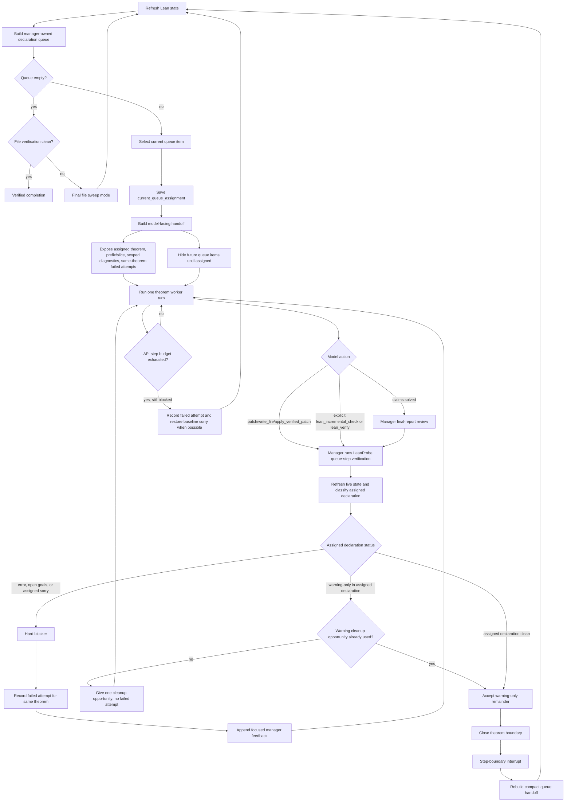

# LeanFlow Product Reference

This is the detailed operational reference for LeanFlow. It preserves the deeper workflow, skill, provider, runtime, and verification notes that previously made the main README hard to scan.

LeanFlow is a Lean AI for Math shell focused on automated Lean coding agents. The command you install and run is still `leanflow`, so existing local setup and scripts stay stable.

The product is optimized for two main jobs:

- `prove`: drive Lean proof repair and completion until the code compiles cleanly
- `formalize`: translate a project-local LaTeX/PDF source document or TeX project directory into statement-verified Lean declarations; `/prove` fills the resulting `sorry`s

Internally, `/prove` and `/autoprove` normalize to the same native workflow, and `/formalize` and `/autoformalize` normalize to the same native workflow. The auto-prefixed forms are compatibility aliases, not separate product surfaces.

It installs as `leanflow`, uses `~/.leanflow` for user-level config, and keeps project-owned workflow state in `.leanflow/`.

This fork removes the old managed `claude-code` and `codex` backend flow. LeanFlow now runs Lean workflows through its own internal `leanflow-native` runtime and routes inference through direct provider APIs, OpenAI-compatible endpoints such as RCP, or local runtimes such as `vllm`, `ollama`, and `llama.cpp`.

## Product Direction

LeanFlow is intentionally Lean-first and automation-first.

- The default shell and workflow UX are built around Lean proving and formalization, not generic assistant chat.
- Autonomous workflows are judged by strict Lean verification, not by partial progress:
  - explicit successful build
  - clean diagnostics
  - no open goals
  - no `sorry`
- Multi-agent execution exists only as an explicit user-approved mode.
- Agents do not auto-spawn by default.
- When swarm mode is enabled, file locks are used to keep concurrent agents off the same file.

## Skills

LeanFlow ships with a small curated skill core for Lean workflows. Skills are not a side feature here; they are part of how the agent is steered toward proving, diagnostics, formalization, resume, and user-approved swarm behavior.

Skills are now the routing/index layer over native workflow and worker specs in `leanflow_specs/`. The canonical Lean contract lives in those markdown-backed specs; skills point the agent at the right spec and tool order for the current workflow state.

Built-in skills:

- `lean-proof-loop`
  - standard proof-repair loop for `prove`
  - emphasizes: inspect diagnostics/goals first, make minimal edits, rebuild, and do not stop until the project is actually verified
- `lean-theorem-queue-worker`
  - single-declaration worker used during file-scoped autonomous proving when the runner has assigned a concrete theorem/lemma queue item
  - emphasizes: stay on the assigned target, use target-scoped failed-attempt history, and hand control back after the declaration is solved or concretely blocked
- `lean-diagnostics`
  - focused diagnostic mode for `review` and `checkpoint`
  - emphasizes: current blockers, open goals, verification state, and project-wide remaining `sorry`
- `lean-formalization`
  - formalization and declaration-building skill for `formalize` and `draft`
  - emphasizes: source-document inspection, blueprint planning, source comments, small verifiable steps, dependency order, and zero build errors / zero `sorry`
- `lean-project-search`
  - local project search helper used before editing proofs
  - emphasizes: nearby declarations, imports, naming/style reuse, and file-local context
- `lean-mathlib-search`
  - Mathlib search helper used when a proof likely depends on an existing library lemma
  - emphasizes: theorem-name discovery, statement inspection, and reducing proof guessing
- `lean-refactor-golf`
  - refactor / golfing skill for `refactor` and `golf`
  - emphasizes: simplifying proof structure without breaking verification
- `lean-autonomous-swarm`
  - swarm skill used only when you explicitly launch a workflow with `--agents N`
  - emphasizes: file ownership, verifier roles, and strict final verification
- `provider-fallback`
  - provider/runtime fallback helper when you need to switch between direct APIs, RCP/custom endpoints, or local runtimes
- `long-session-resume`
  - resume/handoff skill for compacted or checkpoint-restored workflows
  - emphasizes: trust persisted state, compare it to the current filesystem, and continue from the real current Lean state

### How Skills Are Assigned

There are three ways a skill gets into the agent:

1. Automatic workflow assignment
   - `prove`, `autoprove` -> `lean-proof-loop`
   - `formalize`, `autoformalize`, `draft` -> `lean-formalization`
   - `review`, `checkpoint` -> `lean-diagnostics`
   - `refactor`, `golf` -> `lean-refactor-golf`
   - `--agents N` on autonomous workflows switches to `lean-autonomous-swarm`
   - for file-scoped autonomous proving with an assigned declaration queue item, the runner temporarily switches from `lean-proof-loop` to `lean-theorem-queue-worker`

2. Manual shell activation
   - `/skill lean-proof-loop`
   - `/skill lean-diagnostics`
   - `/skill reload`
   - direct activation also works via `/<skill-name>`

3. Resume/continuation context
   - the managed runner can carry the active skill through checkpoints, compaction, and autonomous continuation cycles

When a skill is active, its `SKILL.md` content is inserted into the agent prompt as explicit workflow guidance. The prompt builder and `/skills` surface also expose linked workflow-spec metadata, so the agent sees both the routing skill and the underlying spec contract it should follow.

### Skill Install And Override Paths

Skill discovery order is:

- built-in repo skills in `leanflow_skills/`
- user overrides in `~/.leanflow/skills`
- project overrides in `.leanflow/skills`

Precedence is:

- project overrides user
- user overrides built-in

That means you can replace a built-in skill for one machine or one project without editing the shipped repo skill.

Install patterns:

- user-wide skill:
  - create `~/.leanflow/skills/<skill-name>/SKILL.md`
- project-local skill:
  - create `.leanflow/skills/<skill-name>/SKILL.md` inside the Lean project

Example:

```text
~/.leanflow/skills/my-proof-policy/SKILL.md
.leanflow/skills/lean-proof-loop/SKILL.md
```

The second example overrides the built-in `lean-proof-loop` only for that project.

### How The Agent Sees Skills

The agent does not install skills as code plugins. It loads them as prompt-time workflow instructions:

- the skill resolver finds the highest-precedence matching skill
- LeanFlow reads the skill’s `SKILL.md`
- that content is embedded into the agent prompt for the active workflow
- supporting files under `references/`, `templates/`, `scripts/`, and `assets/` stay discoverable through the skill system when needed

Use `/skills` to see what the agent can currently load and where each skill came from.

## Native Workflow Contract

LeanFlow now treats native markdown specs as the canonical Lean workflow contract.

Spec roots:

- `leanflow_specs/workflows/`
- `leanflow_specs/workers/`

Workflow specs shipped in the repo:

- `prove`
- `formalize`
- `draft`
- `review`
- `refactor`
- `golf`
- `checkpoint`
- `doctor`
- `search`

Dormant worker specs shipped in the repo:

- `proof-repair`
- `proof-golfer`
- `axiom-eliminator`
- `sorry-filler-deep`

These specs are the source of truth for:

- prompt assembly
- native Lean tool ordering and fallbacks
- doctor/capability reporting
- route decisions
- contract validation in tests

Skills remain important, but they are now the routing layer that points to these specs instead of carrying the whole operational contract alone.

For a developer-oriented summary of the native workflow/tool surface, see [native-lean-workflow-surface.md](native-lean-workflow-surface.md).

## What Ships

- `leanflow` CLI with LeanFlow shell branding
- `leanflow-agent` shared agent entrypoint
- Lean workflows:
  - `/draft`
  - `/review`
  - `/checkpoint`
  - `/refactor`
  - `/golf`
  - `/prove`
  - `/formalize`
  - `/autoprove` -> alias of `/prove`
  - `/autoformalize` -> alias of `/formalize`
- Local runtime commands:
  - `leanflow models local list`
  - `leanflow models local start`
  - `leanflow models local stop`
  - `leanflow models local status`
  - `leanflow models local logs`
  - `leanflow models local use`

## Kernel-Only Scope

This repo is now intentionally trimmed to the Lean workflow kernel.

Supported product surface:

- LeanFlow shell UX on top of `leanflow`
- Lean proving and formalization workflows
- user-approved multi-agent swarm mode
- file locking for concurrent Lean editing
- curated Lean skill core in `leanflow_skills/`
- provider routing for direct APIs, RCP/custom endpoints, and local runtimes
- managed local runtimes: `vllm`, `ollama`, `llama.cpp`

Removed from the supported product:

- gateway and messaging platforms
- cron/scheduler product surfaces
- browser automation workflow surface
- website/landing page/docs site
- RL/benchmark environment suites
- generic and marketplace-style skill catalogs
- WhatsApp bridge and other non-Lean platform extras

## Name, CLI, and Paths

- Product name: `LeanFlow`
- CLI command: `leanflow`
- State directory: `~/.leanflow`
- Project manifest: `.leanflow/project.yaml`

The interface is styled around EPFL / Lean / AI-for-math work, but the executable name stays `leanflow`.

## Install

Direct local install from the current repo:

```bash
git clone https://github.com/epfl-lara/LeanFlow.git
cd LeanFlow
./scripts/install-internal.sh
```

If you already have the repo checked out locally, just run:

```bash
./scripts/install-internal.sh
```

`./scripts/install.sh` is the Morph/local-template wrapper. Use `./scripts/install-internal.sh` when you want the repo to install its own local CLI wrappers directly.

Default install locations:

- state: `~/.leanflow`
- wrappers: `~/.local/bin/leanflow`, `~/.local/bin/leanflow-agent`
- virtualenv: `./.leanflow-venv`

The installer also checks or wires the external CLI tools used by normal
workflows: `rg` for repository search and Poppler's `pdftotext`, `pdfinfo`, and
`pdfimages` for PDF source inspection.

Custom install locations:

```bash
./scripts/install-internal.sh \
  --leanflow-home "$HOME/.leanflow" \
  --bin-dir "$HOME/.local/bin" \
  --venv-dir "$PWD/.leanflow-venv"
```

## Update

Update by reinstalling from the repo:

```bash
cd LeanFlow
git pull
./scripts/install-internal.sh
```

Sandboxed install:

```bash
./scripts/install-sandbox.sh
```

The sandbox installer runs the normal install, builds the local Docker/Podman
image, and writes an `leanflow-sandbox` wrapper. To upgrade that runtime:

```bash
./scripts/update-sandbox.sh
```

The sandbox runtime copies the active LeanFlow project into a per-run worktree,
mounts only that copy plus sandbox cache/home directories, and exports the final
diff to `~/.leanflow/sandbox/runs/<run-id>/changes.patch`. See
[sandbox-runtime.md](sandbox-runtime.md) for the isolation and patch-export
contract.

## Quick Start

Check the install:

```bash
leanflow --help
leanflow doctor
leanflow doctor env --json
leanflow mcp bootstrap lean
leanflow mcp status --json
leanflow config show
```

Initialize an existing Lean project:

```bash
cd /path/to/lean-project
leanflow project init
leanflow project show
```

Run a workflow:

```bash
leanflow workflow prove Main.lean
leanflow workflow prove Main.lean --agents 3
leanflow workflow prove Main.lean --no-parallel
leanflow workflow formalize docs/paper.tex
```

## Workflow Example Projects

The repo also carries opt-in Lean workflow projects under `testdata/workflow_projects/`.

These are for manual workflow runs and future targeted integration coverage, not for the default pytest or CI path. `testdata/workflow_projects/ProveDemo` is the proof-repair fixture, and `testdata/workflow_projects/DocFormalizationDemo` is the document-formalization fixture.

Interactive mode:

```bash
leanflow
```

Inside the shell:

```text
/banner
/status
/workflow status
/workflow history
/workflow activity
/workflow log 120
/goals
/diagnostics
/proof-state
/provider
/swarm
/skills
/skill lean-proof-loop
/skill reload
/models local list
/cd path/to/project
/project init
/project create DemoProject --template-source https://github.com/example/lean-template.git
/prove
/prove Main.lean
/prove Main.lean --agents 3
/prove Main.lean --no-parallel
/formalize docs/paper.tex
/doctor
/doctor search --json
/mcp bootstrap lean
/mcp status
/mcp status --json
/config get model.default
/exit
/quit
```

Workflow commands also accept forgiving forms without the leading slash:

```text
prove
prove Main.lean
prove Main.lean --agents 3
prove Main.lean --no-parallel
formalize docs/paper.tex
```

The interactive shell starts with an LeanFlow banner that shows the current route and the main Lean commands you are expected to use.

The bottom toolbar is live workflow context, not decoration. It surfaces:

- current managed workflow phase
- active file and target theorem
- latest build state
- active skill
- latest structured workflow event

The shell also reads persisted managed-workflow state so these commands work across resumed sessions:

- `/workflow status`
- `/workflow history`
- `/workflow activity`
- `/workflow log 120`
- `/goals`
- `/diagnostics`
- `/proof-state`

`/exit` now asks the current project's managed runner to shut down cleanly first, waits briefly for that exit request to land, and only then escalates to direct interrupts/PID termination if the runner is still alive.

## Autonomous Lean Behavior

The native runner is designed for Lean automation, not free-form chat.

What the autonomous runner tries to do:

- identify the active Lean file and target declaration
- inspect diagnostics and goals first
- make the smallest useful edit
- rebuild or re-check diagnostics after meaningful edits
- continue until the target is verified or a concrete blocker remains

What counts as success:

1. the relevant Lean code builds successfully
2. diagnostics are clean
3. there are no open goals
4. there are no `sorry` in the active target
5. there are no remaining `sorry` elsewhere in the project outside dependencies

Autonomous workflows are intentionally stricter than a local file-only loop. `prove` and `formalize` should keep going until the project is clean, not merely until the current theorem looks finished.

### Document Formalization

`/formalize` and `/autoformalize` require a project-local `.tex` source, `.pdf` source, or directory containing a TeX project. They remain the same workflow; `autoformalize` is only a compatibility alias.

The resolver prepares a document formalization workspace before the native runner starts:

- source-document preflight manifest under `.leanflow/workflow-state/formalization/`
- bounded extracted-text cache
- Markdown planner blueprint
- generated supplemental blueprint skill under `.leanflow/skills/`
- active Lean target file for drafted declarations
- original request metadata, selected source document metadata, and deterministic TeX project discovery metadata when the user provided a directory

`/prove SomeFile.lean` auto-attaches that generated blueprint skill when the file has a nearby `Blueprint.md`, so prover turns can recover the source map after context compaction. Any workflow can also receive extra persistent guidance with `--additional-skill path/to/SKILL.md`.
- startup context that tells the drafting agent to plan definitions, lemmas, theorem splits, source comments, source pointers, and statement-fidelity checks before proof repair
- an automatic independent statement/source verifier pass once the draft is otherwise ready and only approval statuses are missing

The deterministic preflight is intentionally modest, but it recognizes common math-paper structure. LaTeX documents get sections, labels, references, citations, theorem-like blocks, and adjacent proof excerpts extracted. The theorem scanner covers standard environments, custom `\newtheorem` environments, `thmtools` `\declaretheorem`, `mdframed` `\newmdtheoremenv` / `\mdtheorem`, Springer `\spnewtheorem`, `tcolorbox` `\newtcbtheorem`, theorem-like `\newenvironment` names, and plain-TeX `\profess...\endprofess` blocks. Directory inputs first select a main TeX entrypoint, collect included `.tex` files, bibliography files, local assets, PDFs, figures, and TeX support files, and reject ambiguous roots with an explicit error. PDFs use installed local tools such as `pdftotext`, `pdfinfo`, and `pdfimages` when available, and record degraded extraction reasons when they are not. The planner agent can then use the normal file, terminal, web, and Lean tools to inspect the document more deeply, pull referenced material, and draft Lean files with `sorry`. The independent verifier then checks the source fidelity and marks approved blueprint entries. When that gate passes, the formalizer gets one final generated-file organization pass, exits, and proof filling waits for an explicit user-run `/prove`.

Expected document-prep completion is a buildable statement/source-approved draft that may still contain intentional `sorry`s. Proof filling is the next phase: it starts only when the user explicitly runs `/prove SomeFile.lean` or `/prove` after reviewing the generated formalization, and it is not part of judging whether the source formalization draft itself is ready.

LeanFlow writes managed workflow status, activity, checkpoints, file locks, and the full latest managed runner log into the active project’s `.leanflow/workflow-state/` directory by default so long runs stay next to the Lean repo you are debugging.

That state now also includes structured capability snapshots and route decisions in `.leanflow/workflow-state/outcomes.jsonl`, so resumed runs can reuse prior blocker classification instead of starting blind.

### Project-Scoped `/prove`

`/prove SomeFile.lean` remains the direct file-scoped proof-repair workflow. `/prove` with no Lean file is the project-scoped manager workflow.

The project prove manager pipeline is:

1. Detect that the command is `prove` and has no explicit `.lean` argument.
2. Scan project Lean files for remaining `sorry` placeholders.
3. Build one candidate record per file with relative file label, absolute path, module name, `sorry_count`, `line_count`, declaration count, pending declaration names, theorem excerpts, hint/example counts, theorem-difficulty scores, candidate-to-candidate import/dependent counts, project-wide import/dependent counts, and import count.
4. Include source context in the planner payload: full source for small files, and selected headers, imports, hints, checked lemmas, and pending theorem excerpts for larger files.
5. Compute a deterministic fallback order: files with more unresolved candidate files depending on them first, then files with fewer unresolved candidate-file dependencies of their own, then project-wide downstream importance, lower theorem-difficulty score, lower first-pending-declaration difficulty, fewer `sorry` placeholders, shorter files, fewer declarations, and path label as the stable tie-breaker.
6. Ask the configured LLM to rank the bounded candidate list using the same policy: dependency importance, theorem difficulty, actual source context, local hints/examples, and length.
7. Sanitize the LLM output so only known candidate labels survive, append any missing fallback files, and keep deterministic dependency/difficulty buckets as guardrails around the model order.
8. Persist the resulting queue and assign the first file by setting the native active file.
9. Hand execution to the existing file-scoped theorem queue, exactly as if the user had run `/prove SomeFile.lean`.
10. When that file verifies and other project files still contain `sorry`, mark the file complete, refresh the queue against the current filesystem, and assign the next file.

This keeps the manager responsible for file order only. The existing theorem queue remains responsible for theorem-level repair, diagnostics, failed-attempt history, incremental verification, final file sweeps, and blocker handling.

Parallel agents are disabled by default. The manager assigns one file at a time unless the user explicitly starts a swarm workflow with an agent-count flag such as `--agents 3`.

### Logging And Inspection

Project prove-manager state is visible in the same surfaces as other managed workflows:

- `/workflow status` reads `.leanflow/workflow-state/live_status.json`
- `/workflow activity` reads structured JSONL events under `.leanflow/workflow-state/activity/runs/`
- `/workflow log 120` tails the saved raw runner transcript from `.leanflow/workflow-state/latest-run.log` or the timestamped file under `.leanflow/workflow-state/runs/`
- `/proof-state` includes the live proof-state message that is also sent back into autonomous continuation prompts

For fileless `/prove`, `live_status.json` includes:

- `project_prove_manager`
- `project_prove_file_queue`
- `project_prove_completed_files`
- `project_prove_plan_source`
- `project_prove_plan_reason`
- the normal active-file, target theorem, declaration queue, diagnostics, goals, build, route, checkpoint, and model/provider fields

The structured activity stream records manager events suitable for detailed inspection and offline trace curation:

- `project-prove-file-queue-planned`: candidate metrics, final file order, plan source, and plan reason
- `project-prove-file-assigned`: assigned file, absolute path, remaining queue, plan source, and plan reason
- `project-prove-file-queue-empty`: no project files with `sorry` were found
- `project-prove-file-queue-complete`: the project prove queue has no remaining candidate files

Those events sit alongside the existing theorem-level and runner-level events:

- `queue-item-assigned`
- `manager-incremental-warmup`
- `assistant-plan`
- `tool-start`
- `tool-result`
- `autonomous-followup`
- `checkpoint`
- `runner-start` / `runner-exit`

The structured activity feed is the right source for programmatic inspection and training-data curation because it preserves event types and details as JSON. The raw workflow log is the right source when a human needs the chronological transcript, provider previews, tool output head/tail, token usage, and cost estimates. Preview sizes are bounded and configurable through `logging.preview_lines`, `logging.preview_chars`, `logging.tool_output_head_lines`, `logging.tool_output_tail_lines`, and `logging.activity_preview_chars`.

The verification loop is intentionally Lean-LSP-first:

- use diagnostics and proof goals for most iterations
- for ordered same-file theorem-queue turns, use `lean_incremental_check(check_target)` as the primary queue-step verifier; it is backed by LeanProbe, keeps a LeanInteract server warm, reuses header/import state, and checks only the assigned declaration chunk
- keep the canonical `lake env lean <file>` path for final file/project sweeps, explicit canonical checks, and LeanProbe fallback recovery
- the queue manager performs controlled LeanProbe warmup with `prepare_file` when a theorem assignment is created or changes, so patch verification can reuse the warmed server
- agents should use `lean_incremental_check` or `lean_verify` for normal theorem-queue verification so the manager can classify the assigned declaration; terminal-based Lake checks remain available as an emergency/manual fallback when Lean tools themselves are broken
- do not treat `lake build`, `grep`, `head`, or truncated output as proof that an assigned theorem is clean
- outside those theorem-scoped turns, avoid repeated `lake env lean <file>` checks because they are slow on large imports
- prefer a focused `lake build <Module>` when the active file is close to clean
- reserve full-project `lake build` for milestone verification and final success checks

Managed automation backends are intentionally treated as optional infrastructure behind the native Lean tools, not as authoritative proof state. When an automation backend misses a declaration that the local file queue can already see, LeanFlow records the backend miss in `degraded_reasons`, degrades cleanly, and continues with local source context instead of stalling the run.

The inspection split is intentional:

- `/workflow activity` is the structured step feed: API calls, assistant plans, tool starts, resumes, checkpoints, and autonomous follow-ups
- `/workflow log 120` is the raw saved runner transcript when you want the exact command/tool chronology that scrolled by during execution
- workflow logs include API-step separators, bounded prompt/assistant/reasoning previews, token usage, and cost estimates when provider pricing metadata is known
- long multiline tool outputs keep both the head and tail instead of only the start
- those preview limits are configurable through `logging.preview_lines`, `logging.preview_chars`, `logging.tool_output_head_lines`, `logging.tool_output_tail_lines`, and `logging.activity_preview_chars`

## Native Lean Tool Surface

The agent now has a repo-owned Lean tool surface instead of relying on prompt text and shell heuristics alone. These tools are available through the `lean`, `leanflow-native`, and `leanflow-native-swarm` toolsets.

- `lean_capabilities`
  - probe project validity, Lean/Lake/Elan binaries, MCP/LSP tools, search providers, helper availability, worker availability, and degraded-mode reasons
- `lean_inspect`
  - return structured Lean state for a file: diagnostics, goals, `sorry` counts, blocker classification, queue candidates, and the current capability snapshot
- `lean_verify`
  - run the canonical verification ladder in `file_exact`, `module`, or `project` mode
- `lean_incremental_check`
  - run the fast LeanProbe/LeanInteract-backed verifier for ordered same-file theorem queues
  - `prepare_file` warms imports/header and optionally advances cached environments to a target declaration
  - `check_target` verifies the assigned declaration or replacement chunk with `allow_sorry=False`
  - `feedback` returns diagnostics and optional tactic/proof-state annotations for repair prompts
  - default usage for queue progress:
    - `lean_incremental_check(file_path="Demo/Main.lean", theorem_id="my_theorem", action="check_target")`
    - read `ok`, `valid_without_sorry`, `has_errors`, `has_sorry`, `messages`, `elapsed_s`, and `cache`
  - richer repair usage:
    - set `include_tactics=true`, or use `action="feedback"`, when diagnostics are not enough and the model needs intermediate tactic states
    - inspect `tactics[*].tactic`, `tactics[*].goals`, `tactics[*].proof_state`, `tactics[*].file_start`, `messages[*].file_start`, and `feedback_lean`
    - `feedback_lean` is the model-readable version of the current declaration with inserted feedback comments; use it to repair the proof at the exact failing line
    - failures automatically try to rerun with tactic collection when possible, so blocked proofs usually return richer context without slowing successful checks
  - trust it for queue-step validity when LeanProbe is available, the project-local REPL matches the current toolchain, the cached environment was built from current file content up to the target, and the checked chunk exactly matches the current declaration replacement
  - use `lean_verify` instead for final sweeps, unavailable/crashed/stale LeanProbe sessions, header/import/earlier-declaration edits, non-ordered queues, or explicit canonical checks
- `lean_search`
  - search in `auto`, `local`, `semantic`, `type-pattern`, or `natural-language` mode
  - prefers MCP/LSP-backed providers first and falls back to local `rg`/Mathlib search with explicit provider provenance and degraded reasons
- `lean_proof_context`
  - theorem-context retrieval from the managed automation backend: theorem statement, original proof text, hypotheses, in-scope names, namespace, and similar proofs
  - this is not a replacement for `lean_inspect` goals
  - when the active file already contains the target declaration, LeanFlow first stabilizes lookup from the local declaration range before asking the backend for richer context
  - if the proof-auto backend reports `theorem_not_found` or another backend-side context failure, LeanFlow falls back to a local declaration-slice context instead of pretending the backend succeeded
  - a theorem-lookup miss does not disable proof-auto for the rest of the run; LeanFlow only sticky-disables proof-auto after transport or systemic backend failures
- `lean_multi_attempt`
  - screen 2-6 concrete tactic candidates at one proof location through the MCP backend
- `lean_auto_search`
  - ask the managed automation backend for one theorem-local automated proof candidate after proof context or concrete local evidence exists
- `apply_verified_patch`
  - compatibility path for one atomic Lean patch, pre-edit checkpoint, and immediate verification payload
  - in managed queue workflows, successful `patch` and `write_file` edits are already verified by the manager before the queue advances
- `lean_sorries`
  - list remaining `sorry` findings across a project or a single file with declaration names and line numbers
- `lean_axioms`
  - run a best-effort `#print axioms` check for one declaration and report `axioms`, `custom_axioms`, `classical`, and `choice`
## Theorem-By-Theorem Proving Loop

For file-scoped autonomous workflows (`prove` / `formalize` with an active Lean file), LeanFlow drives the agent one declaration at a time instead of letting it roam the whole file. The runner owns the queue; the agent only owns the current assignment.

What the runner does each cycle:

1. Refresh Lean state.
   - Resolve the active file and current target from the workflow command, checkpoint state, or refreshed queue state.
   - Run `lean_inspect` when available; otherwise query diagnostics and goals through the fallback wrappers.
   - Keep the raw diagnostics, goals, build status, `sorry` counts, and queue candidates in the manager-owned live state.

2. Build the manager-owned declaration queue.
   - Add declarations that contain `sorry`.
   - Add declarations that have theorem-level errors, open goals, or error diagnostics pointing into their declaration range.
   - Prefer real error diagnostics over later `sorry` placeholders when choosing the current item.
   - Do not put warning-only declarations into the primary theorem queue. Warning-only issues are handled as one local cleanup opportunity for the assigned declaration, or later by the final file sweep.

3. Select one current queue item.
   - If the queue is non-empty, store the assignment in `current_queue_assignment` as `(target_symbol, active_file, slice)`.
   - While this assignment is active, the runner switches the active skill to `lean-theorem-queue-worker`.
   - The assignment is the worker boundary. The model owns the assigned proof task, may add small helper declarations that directly support it, and must not modify pre-existing non-assigned declarations or future queue items.

4. Build the model-facing handoff.
   - The manager keeps the full queue internally for status, resume, and next-target selection.
   - The prompt exposes only the current queue horizon:
     - assigned declaration name
     - exact file path and display file label
     - current blocker for that declaration
     - current file prefix ending at that declaration, capped to the last 200 lines for token hygiene
     - assigned declaration slice
     - recent failed attempts for the same `(theorem, file)` pair
     - scoped diagnostics for the assigned declaration
   - Future queued declarations are hidden from the model-facing live proof state until the manager assigns them.
   - Future `sorry` warnings do not appear as current proof requirements. The prompt says that future queue items are hidden until assigned.

5. Let the model work one theorem turn.
   - The model may inspect the file, search, ask for proof context, or edit with `patch`, `write_file`, or `apply_verified_patch`.
   - During a theorem queue turn, terminal-based file edits are rejected. Shell verification is allowed, but edits must go through file tools so the manager can check the assigned-declaration boundary.
   - New helper declarations are allowed when they directly help the assigned theorem; the manager does not restore them merely because they are outside the assigned declaration body.
   - If a file tool changes a pre-existing non-assigned declaration or future queue item, the manager restores those protected declarations to their assignment-start state and reports the queue edit guard in the tool result.
   - `patch` and `write_file` are preferred in managed queue workflows; the manager warms LeanProbe with `prepare_file` at assignment time, and after a successful edit it first runs `lean_incremental_check(check_target)` for the assigned declaration.
   - If LeanProbe is unavailable, crashes, times out, or cannot rebuild a valid cache, the manager falls back to the canonical file verification gate.
   - Direct terminal verification commands are not the normal managed path because the manager cannot classify them as precisely, but they remain available as an emergency/manual fallback if the Lean tool surface is broken.
   - `apply_verified_patch` remains available when the atomic checkpoint plus verification payload is useful.
   - An explicit `lean_incremental_check(check_target)` or `lean_verify(mode=file_exact)` can also close the assigned theorem turn because the manager falls back to the saved assignment even if no pending-feedback flag is set.
   - If the model claims "solved" in a final report, the manager still runs deterministic review before accepting the claim.

6. Classify the post-edit or final-report state.
   - Hard blockers inside the assigned declaration:
     - remaining `sorry`
     - Lean errors
     - unsolved goals
     - manager verification output that points to assigned-declaration errors
   - Warning-only cleanup inside the assigned declaration:
     - no errors, no goals, no assigned-declaration `sorry`
     - diagnostics are warnings scoped to that declaration
   - Future queue items:
     - later declarations with `sorry` or warnings
     - unrelated file-level diagnostics that do not point at the assigned declaration

7. Branch on the classification.
   - If the assigned declaration has hard blockers:
     - keep the same theorem turn alive
     - record a theorem-local failed attempt for that exact `(theorem, file)`; this feeds `PREVIOUS ATTEMPTS` context and reasoning-effort escalation if the same theorem continues or returns later
     - append manager feedback to the next model step
     - do not advance the queue
   - If the assigned declaration has warning-only cleanup:
     - give one focused warning-cleanup opportunity for that same assigned declaration
     - the opportunity starts when the manager first sees this state and sends warning-only feedback back into the same theorem turn
     - starting the opportunity increments the manager warning-cleanup counter for this `(theorem, file)`
     - this is not a single API step and not a new workflow run; the model continues the same theorem turn using the remaining workflow budget
     - the opportunity is evaluated at the next manager gate for that same theorem: successful `patch` / `write_file` LeanProbe auto-verification, `apply_verified_patch`, explicit `lean_incremental_check(check_target)`, explicit `lean_verify(mode=file_exact)`, or manager review of a final "solved" report
     - do not record a failed proof attempt
     - tell the model to fix only the assigned-declaration warning context and not edit future queued declarations; helper declarations created for this theorem remain part of this turn's proof work
     - if that next manager gate sees no warnings, accept the theorem and advance
     - if that next manager gate still sees only assigned-declaration warnings and no hard blockers, accept the theorem and advance
     - if that next manager gate sees an error, open goal, or assigned-declaration `sorry`, switch to the hard-blocker branch
   - If only future queue items remain:
     - accept the current theorem
     - close the theorem boundary
     - request a step-boundary interrupt
     - rebuild the next prompt from a deterministic queue handoff
   - If the model claims success but manager review finds hard blockers:
     - reject the claim
     - continue the same theorem
     - after the hard retry limit is exhausted, preserve the failed proof state, restore the baseline `sorry` slice when possible, mark the theorem unresolved, and let the queue continue from a safe file state

8. Handle API step-budget exhaustion.
   - If the API step budget expires while the assigned theorem is still hard-blocked by errors, open goals, or assigned-declaration `sorry`, record a theorem-local failed attempt.
   - If the proof is already clear and only warning-only cleanup remains, do not turn that into a failed proof attempt; the warning cleanup policy still allows the queue to advance after its focused opportunity is spent.
   - When the original assignment slice is available, comment/preserve the current failed proof body and restore the assigned declaration to its safe baseline `sorry` body.
   - Refresh live state and continue from the recorded failed-attempt context; this is not success. The theorem remains unresolved and can re-enter the queue from the restored `sorry` body.

9. Rebuild the handoff after a theorem boundary.
   - When the current assignment changes, discard raw theorem-local transcript, long tool output, and previous-theorem reasoning from the live prompt.
   - Preserve a compact workflow snapshot, the active skill contract, and a deterministic theorem-transition handoff.
   - Print the handoff in the run log so humans can see exactly what the next model turn receives.
   - The next model turn starts with the new assigned theorem and a filtered current queue horizon, not the previous theorem's broad file context.

10. Finish or final-sweep when the queue is empty.
    - If the declaration queue is empty and file verification is clean, log that no final verification sweep is needed.
    - If the declaration queue is empty but file verification still has hard blockers, start final file sweep mode.
    - If file verification exits successfully and only warnings remain, accept the file as complete after the final sweep signal; warning-only style cleanup must not loop forever.
    - Only final file sweep mode permits whole-file cleanup instead of single-theorem focus.

Flow:



Queue handoff invariants:

- The manager owns the full queue; the model sees only the assigned theorem horizon.
- Future theorem `sorry` warnings are not model-facing proof obligations until assigned.
- Raw diagnostics from future declarations are not classified as current-theorem manager feedback after the assigned declaration's target-level check has succeeded.
- Queue turns are scoped to the assigned proof task. New helper declarations that directly support the assigned theorem are allowed, while broad shell replacements, whole-file rewrites, and accidental edits to pre-existing future queue items are blocked or restored by the manager.
- The assigned theorem is successful when that declaration has no `sorry`, no open goals, no errors, and either no warning-only cleanup remains or its one focused warning-cleanup opportunity has already been spent.
- Hard blockers keep the same theorem turn alive and become theorem-local failed-attempt context.
- Warning-only cleanup never becomes a failed proof attempt and cannot stall the queue indefinitely.
- Failed-attempt memory has two effects: it is scoped to the same `(theorem, file)` so the model can see prior proof shapes when that theorem continues or returns later, and hard exhaustion can restore the declaration to its baseline `sorry` slice so the queue can continue from a safe file state.
- A final report from the model is a claim, not proof. The manager accepts it only after deterministic file verification and assigned-declaration checks.
- Queue transitions rebuild the prompt from compact manager state instead of carrying previous-theorem reasoning into the next theorem.
- The final file sweep is the only mode where the worker may clean whole-file residual warnings without a single assigned declaration.
- Final file sweep completion is warning-tolerant: `lean_verify`/file verification must exit successfully, `sorry` must be gone in the active file, and no hard diagnostics or open goals may remain; style warnings alone are accepted.

## Routing And Specialist Workers

The queue remains the center of autonomous Lean execution, but the runner now makes route decisions from structured workflow state instead of a single hard-coded skill switch.

The router currently consumes:

- workflow kind
- active queue item
- blocker kind
- failed-attempt count
- search exhaustion
- capability/degraded-mode state

Queue items are enriched with:

- target line numbers
- blocker signatures
- search hints
- verification gates
Route decisions are persisted into workflow state so later cycles can reuse them.

## Reasoning / Thinking Policy

LeanFlow now defaults to:

```yaml
agent:
  max_turns: 200
  reasoning_effort: "auto"
  seed: 42
  temperature: 0.3
  top_p: null
  top_k: null
  min_p: null
```

`auto` is Lean-specific rather than a generic chat setting:

- managed theorem-queue turns start at `medium`
- after `5` failed attempts on the same `(theorem, file)` pair, the runner raises that theorem's reasoning intensity to `high`
- when the queue moves to a different theorem, the new theorem resets back to `medium`
- when the declaration queue is empty but the file still needs a final cleanup pass, the whole-file sweep uses `high`
- failed-attempt memory is scoped per theorem, so previous theorems do not drag old blocker history into unrelated prompts

Operational details:

- the failed-attempt counter increments on each failed `edit -> verification feedback -> still blocked` boundary, not only once per long conversation
- the default reasoning escalation threshold is configurable with `LEANFLOW_NATIVE_FAILED_ATTEMPT_REASONING_THRESHOLD`
- the `PREVIOUS ATTEMPTS` cap is configurable with `LEANFLOW_NATIVE_FAILED_ATTEMPT_HISTORY` and defaults to `10`

You can still override it explicitly:

```bash
/reasoning auto
/reasoning none
/reasoning low
/reasoning minimal
/reasoning medium
/reasoning high
/reasoning xhigh
```

On routes that only support `low|medium|high`, LeanFlow maps automatically:

- `minimal -> low`
- `xhigh -> high`
- `none` disables model thinking entirely

Sampling defaults are Lean-oriented rather than chatty:

- `seed: 42` keeps runs more reproducible on compatible routes
- `temperature: 0.3` leaves a small amount of exploration for proof search
- `top_p`, `top_k`, and `min_p` stay unset by default

This mode is automatic for autonomous workflows with an `ACTIVE_FILE`. For project-wide autonomous runs the queue is per-file instead of per-declaration, and swarm mode (`--agents N`) is the path for parallel per-file work.

## User-Approved Swarm Mode

LeanFlow supports multi-agent Lean work, but only when the user explicitly requests it.

Default behavior:

- `prove` and `formalize` run as a single autonomous agent
- no automatic agent spawning is allowed

Explicit swarm behavior:

```bash
leanflow workflow prove Main.lean --agents 3
leanflow workflow formalize docs/paper.tex --agents 3
```

What `--agents N` does:

- switches the native workflow from `leanflow-native` to the swarm-capable tool surface
- enables user-approved delegation inside that workflow only
- activates the `lean-autonomous-swarm` skill unless you manually selected another skill
- records the configured agent count in workflow status

Important constraint:

- swarm mode is user-approved only
- agents do not decide to spawn other agents unless the workflow was launched with `--agents N`

Recommended use:

- one agent per file when files are independent
- one verifier-oriented path to keep builds and diagnostics honest
- no duplicate ownership of the same Lean file

## Project Model

LeanFlow currently exposes two project commands:

- `leanflow project init [path] [--name NAME]`
- `leanflow project create <path> [--template-source SOURCE] [--name NAME]`
- `leanflow project show [path]`

Requirements for `project init`:

- the target must be inside a Lean 4 repo
- a Lean root must be detectable from `lakefile.lean` or `lakefile.toml`
- REPL acceleration setup is attempted automatically; `lakefile.toml` projects can be updated safely, while ambiguous `lakefile.lean` projects receive manual setup instructions

LeanFlow writes:

- `.leanflow/project.yaml`
- `.leanflow/runtime/`
- `.leanflow/cache/`
- `.leanflow/workflows/`

During `project init`, LeanFlow prints visible REPL setup progress:

- inspect Lean project
- detect `lean-toolchain`
- check for an existing `repl` binary or dependency
- add the `leanprover-community/repl` dependency when safe
- run `lake update repl`
- run `lake build repl`

Long Lake commands print status before and after execution, including elapsed time. A failed REPL setup is a warning, not a project-init failure; proof workflows continue with LSP-backed tactic screening.
- `.leanflow/workflow-state/`

## Skills And Overlays

LeanFlow ships a curated Lean-first skill core. It does not use the old broad marketplace-style catalog in the supported product.

Builtin skills live in:

```text
leanflow_skills/
```

User and project overlays live in:

```text
~/.leanflow/skills
.leanflow/skills
```

Overlay precedence is:

1. project
2. user
3. builtin

Supported shell commands:

```text
/skills
/skill <name>
/skill reload
/<skill-name>
```

Current curated builtin skills:

- `lean-proof-loop`
- `lean-theorem-queue-worker`
- `lean-diagnostics`
- `lean-formalization`
- `lean-project-search`
- `lean-mathlib-search`
- `lean-refactor-golf`
- `lean-autonomous-swarm`
- `provider-fallback`
- `long-session-resume`

Lean workflows automatically select a matching default skill unless you activate another one explicitly.

The swarm-specific skill is only relevant when the user enabled parallel agents. It encodes:

- file-specific delegation
- verifier roles
- strict zero-sorry finish conditions
- lock-before-edit behavior for shared Lean files

## File Locking

LeanFlow includes file reservations for concurrent Lean work.

Purpose:

- stop two agents from editing the same Lean file at the same time
- make user-approved swarm runs safer and easier to reason about

How it works:

- file reservations are stored in `.leanflow/workflow-state/file_locks.json` inside the active project
- the native workflow tool surface includes:
  - `acquire_file_lock`
  - `release_file_lock`
  - `list_file_locks`
- file writes through `write_file` and `patch` respect existing locks
- if another agent owns the lock, the write is rejected instead of silently racing
- locks are keyed to the stable agent session id, not a transient per-turn task id
- native runner and delegated child agents release their locks on exit

Current scope:

- lock enforcement is wired into file-tool writes
- this gives strong protection for the recommended edit path
- terminal-based ad hoc shell edits are still a weaker path and should be avoided in swarm workflows

## Repository Layout

The main active codepaths are:

- `leanflow_cli/` for shell UX, config, project/workflow orchestration, local runtimes, locks, and workflow state
- `leanflow_skills/` for the curated Lean skill core
- `agent/` for prompt assembly, context compression, display, and shared agent internals
- `tools/` for the Lean-kernel tool surface
- `tests/leanflow/` plus selected agent/runtime tests for the supported product

You should not expect deleted gateway, website, cron, data-generation, voice, or broad skill-catalog directories to exist anymore.

## Provider Configuration

Inspect the active provider selection:

```bash
leanflow provider
leanflow provider --requested zai
leanflow provider --requested local
leanflow provider --requested custom
```

LeanFlow supports three provider classes:

1. Direct provider APIs
2. OpenAI-compatible remote endpoints
3. Managed local runtimes

### Direct Providers

Supported direct providers include:

- `zai`
- `kimi-coding`
- `minimax`
- `minimax-cn`
- `deepseek`
- `anthropic`

Example:

```bash
export GLM_API_KEY=...
leanflow provider --requested zai
```

### OpenAI-Compatible Remote Endpoints

RCP-style endpoints work through the `custom` path:

```bash
export LEANFLOW_OPENAI_BASE_URL="https://inference.rcp.epfl.ch/v1"
export LEANFLOW_OPENAI_API_KEY="..."
leanflow provider --requested custom
```

Preferred env var names for LeanFlow are `LEANFLOW_OPENAI_BASE_URL` and `LEANFLOW_OPENAI_API_KEY`.
Legacy/generic names such as `OPENAI_BASE_URL` and `OPENAI_API_KEY` are still accepted, but the LeanFlow-prefixed names are the stable user-facing ones.

The `LEANFLOW_NATIVE_*` variables are internal workflow-launcher plumbing. The CLI sets those automatically when it starts `leanflow-native`; you should not need to export them manually.

For RCP / vLLM-style endpoints, LeanFlow enables model thinking through provider-compatible request fields instead of only the OpenRouter-style `reasoning` payload:

- `extra_body.chat_template_kwargs.enable_thinking`
- `extra_body.reasoning_effort`

That matches AIaaS/RCP-style models such as Qwen hybrid reasoning checkpoints and GLM routes that expose reasoning content on the OpenAI-compatible API.

If GLM is down, the tested fallback model on that endpoint is:

```text
google/gemma-3-27b-it
```

Use the exact model name. The endpoint is case-sensitive.

Inside the interactive shell, `/provider` shows both the resolved provider and the supported target names so you can verify the route before launching a workflow.

### Local Runtimes

Select a local runtime:

```bash
leanflow models local use vllm google/gemma-3-27b-it
leanflow provider --requested local
```

Start a local runtime:

```bash
leanflow models local start vllm google/gemma-3-27b-it
leanflow models local status vllm
leanflow models local logs vllm
```

Other supported runtimes:

- `ollama`
- `llama_cpp`

## Workflow Tool Surfaces

There are now three important internal workflow surfaces:

- `lean`
  - shared typed Lean capability surface
  - includes `lean_capabilities`, `lean_inspect`, `lean_verify`, `lean_incremental_check`, `lean_search`, `lean_proof_context`, `lean_multi_attempt`, `lean_auto_search`, `apply_verified_patch`, `lean_sorries`, `lean_axioms`, `lean_reasoning_help`, and `lean_decompose_helpers`
- `document`
  - project-local source-document inspection for formalization
  - includes `read_pdf` and `formalization_document_inspect`

- `leanflow-native`
  - default single-agent Lean workflow runtime
  - includes the shared `lean` and `document` toolsets plus file, terminal, web, session search, skills, and file-lock coordination
  - does not include delegation
- `leanflow-native-swarm`
  - enabled only for user-approved `--agents N` workflows
  - adds delegation on top of the same native Lean tool surface
  - intended for bounded multi-agent Lean runs with file ownership rules

## Configuration

Main config file:

```text
~/.leanflow/config.yaml
```

Main env file:

```text
~/.leanflow/.env
```

Top-level config shape:

```yaml
leanflow:
  project:
    template_source: ""
  workflow:
    managed_state_dir: ""
    autonomous_followups: 6

model:
  default: moonshotai/Kimi-K2.6
  provider: auto
  base_url: ""
  api_key: ""

auxiliary:
  lean_reasoning:
    provider: main
    model: moonshotai/Kimi-K2.6-int4
    reasoning_effort: high
    base_url: ""
    api_key: ""
    command_template: ""
    codex_command_template: ""
    claude_code_command_template: ""
  blueprint_verification:
    provider: main
    model: ""
    reasoning_effort: ""
    base_url: ""
    api_key: ""
    command_template: ""
    codex_command_template: ""
    claude_code_command_template: ""
  autoformalizer_verification:
    provider: local
    model: ""
    reasoning_effort: ""
    base_url: ""
    api_key: ""
    command_template: ""
    codex_command_template: ""
    claude_code_command_template: ""

agent:
  max_turns: 200
  reasoning_effort: "auto"
  seed: 42
  temperature: 0.3
  top_p: null
  top_k: null
  min_p: null

compression:
  enabled: true
  threshold: 0.75
  summary_model: moonshotai/Kimi-K2.6
  reserved_output_tokens: 20000
  prune_tool_output: true
  prune_keep_recent_user_turns: 2

local_models:
  default_runtime: vllm
  active_runtime: ""
  active_model: ""
  runtimes:
    vllm:
      host: 127.0.0.1
      port: 8000
      extra_args: []
    ollama:
      host: 127.0.0.1
      port: 11434
      extra_args: []
    llama_cpp:
      host: 127.0.0.1
      port: 8080
      extra_args: []

logging:
  preview_lines: 8
  preview_chars: 1600
  tool_output_head_lines: 28
  tool_output_tail_lines: 12
  activity_preview_chars: 420
```

Useful commands:

```bash
leanflow config get model.default
leanflow config set model.default '"moonshotai/Kimi-K2.6"'
leanflow config set model.provider '"auto"'
leanflow config set model.base_url '"https://inference.rcp.epfl.ch/v1"'
leanflow config set auxiliary.lean_reasoning.model '"moonshotai/Kimi-K2.6-int4"'
leanflow config set auxiliary.lean_reasoning.provider '"main"'
leanflow config set auxiliary.lean_reasoning.reasoning_effort '"high"'
leanflow workflow prove Main.lean --expert-provider codex
leanflow workflow prove Main.lean --expert-provider claude-code
leanflow config set auxiliary.blueprint_verification.provider '"claude-code"'
leanflow config set auxiliary.autoformalizer_verification.provider '"local"'
leanflow config set agent.reasoning_effort '"auto"'
leanflow config set agent.seed '42'
leanflow config set agent.temperature '0.3'
leanflow config set agent.top_p 'null'
leanflow config set agent.top_k 'null'
leanflow config set agent.min_p 'null'
```

`lean_reasoning_help` uses the configured `auxiliary.lean_reasoning` model as a
deep theorem advisor. Its default response budget is `64000` tokens so hard
proof advice is not prematurely clipped; override with
`LEANFLOW_LEAN_REASONING_HELP_MAX_TOKENS` when a provider needs a lower cap.
Main model calls wait up to `1200` seconds by default before LeanFlow treats the
provider request as timed out; override with `LEANFLOW_API_TIMEOUT` if needed.

For opt-in command advisors, set `auxiliary.lean_reasoning.provider` or pass
`--expert-provider codex` / `--expert-provider claude-code` on a workflow.
Command templates may be supplied with `--expert-command-template`,
`AUXILIARY_LEAN_REASONING_COMMAND_TEMPLATE`, or the provider-specific
`LEANFLOW_EXPERT_CODEX_COMMAND_TEMPLATE` /
`LEANFLOW_EXPERT_CLAUDE_CODE_COMMAND_TEMPLATE` variables. Commands are split
without a shell and receive the full advisor prompt on stdin; workflow activity
logs record the prompt, command, exit status, response, and truncation metadata.

Formalization verification uses two separate auxiliary tasks. `auxiliary.blueprint_verification`
controls the independent statement/source review for document blueprints. The default
`main` path preserves the managed reviewer-agent behavior. Setting it to `codex`
or `claude-code` runs the corresponding command reviewer; setting it to another
model/RPC provider records an advisory review report. `auxiliary.autoformalizer_verification`
controls advisory review around the deterministic handoff verifier and defaults
to `local`. Non-local verifier output can propose corrections or review source
fidelity, but deterministic local checks and Lean kernel verification remain the
authoritative acceptance gate.

If an endpoint omits or misreports model context-window metadata, pin the value
in `~/.leanflow/config.yaml`:

```yaml
model:
  context_lengths:
    vendor/model-id: 200000
```

Lean declaration edits are guarded by default. File write and patch tools block
deleting, renaming, moving, or changing existing `theorem`, `lemma`, and
`example` statements; proof-body edits and new declarations are allowed. In a
managed theorem queue turn, the queue guard additionally restores edits to
pre-existing non-assigned declarations while allowing new helper declarations
for the assigned theorem. For an intentional statement refactor, set
`LEANFLOW_ALLOW_LEAN_STATEMENT_EDITS=1` in the process environment or
`~/.leanflow/.env`, then unset it again after the refactor.

Compression defaults are tuned for long Lean sessions:

- `reserved_output_tokens` keeps headroom for the next response instead of filling the full context window.
- `prune_tool_output` replaces stale old tool result bodies with a fixed marker.
- `prune_keep_recent_user_turns` keeps the newest user turns and their nearby tool output intact.
- the compression gate checks the exact outgoing API payload before every model call, including provider-specific reasoning replay fields such as `reasoning_content`.
- provider usage accounting can undercount replayed reasoning for some backends; the `Request: ~N tokens` log line is the local payload estimate used for pre-send compression.
- for custom endpoints, LeanFlow does not use OpenRouter context metadata; it uses config overrides, provider `/models` metadata, curated defaults, or the conservative `200,000` token fallback.

## Doctor And MCP Status

Run:

```bash
leanflow doctor
leanflow doctor env
leanflow doctor mcp --json
leanflow doctor search --json
leanflow mcp bootstrap lean
leanflow mcp status
leanflow mcp status --json
```

Supported doctor modes:

- `all`
- `env`
- `mcp`
- `search`
- `migrate`
- `cleanup`

`doctor` is now non-throwing and uses the same capability layer as the Lean workflows. It reports:

- `git`
- `rg`
- `lake`
- `elan`
- current LeanFlow home and config
- active project discovery
- current provider resolution
- MCP/LSP tool availability
- search-provider availability
- helper-tool availability
- available native workers
- degraded-mode reasons

LeanFlow now treats MCP as default backend infrastructure for native Lean tools, not as a separate user-facing workflow.

Installer/bootstrap-managed default Lean MCP backends:

- `lean-probe>=0.2.2,<0.3`
  - Python package dependency powering the LeanFlow `lean_incremental_check` compatibility tool
  - provides the LeanProbe/LeanInteract-backed queue-step verifier, target feedback, tactic states, and warm same-file declaration cache
  - used as an internal verifier surface, not exposed as a separate user workflow; final file/project acceptance still goes through Lake
- `lean-lsp-mcp==0.26.1`
  - primary state/search backend
  - diagnostics, goals, local search, semantic search helpers, state/premise/hover/outline discovery, and `lean_multi_attempt`
  - configured with local power modes: `LEAN_REPL=true`, `LEAN_LOOGLE_LOCAL=true` on Linux/macOS/WSL, `LEAN_REPL_TIMEOUT=60`, and `LEAN_REPL_MEM_MB=8192`
  - search order prefers local Loogle when ready and toolchain-compatible with the active project, then public remote Loogle/Lean search fallbacks, then project/Mathlib `rg`
- `lean-proof-auto-mcp@v0.4.0`
  - secondary automation/context backend
  - theorem-local context and automation helpers such as `get_proof_context`, `probe`, `search_automated_proof`, and `try_automated_proof`
  - LeanFlow uses it through native wrappers and now degrades cleanly when backend lookup misses a declaration that exists in the local file
- `lean-explore`
  - optional semantic declaration-search backend
  - `lean_search` prefers the local backend when `lean-explore[local]` is installed and `lean-explore data fetch` has prepared the index
  - `lean_search` uses the hosted API only when `LEANEXPLORE_API_KEY` is present and local search is unavailable or disabled
  - installed and configured disabled by default as an MCP server because the API backend requires credentials; enable it in `~/.leanflow/config.yaml` for MCP tools or switch its args to the local backend after fetching LeanExplore data

The install script bootstraps these backends by default under `~/.leanflow/mcp/venvs/`. To repair or recreate them later, run:

```bash
leanflow mcp bootstrap lean
```

`leanflow mcp status` now shows server role labels, whether a server is LeanFlow-managed, whether it is configured/installed, local Loogle/REPL power-mode status, public remote fallback policy, and whether bootstrap is recommended. The same surfaces are available in the interactive shell through `/doctor ...`, `/mcp bootstrap lean`, and `/mcp status [--json]`.

Local Loogle requires Unix-like systems (Linux, macOS, or WSL), `git`, `lake`/`elan`, and roughly 2GB of disk. The first local Loogle build can take 5-10 minutes; later starts are fast. If local Loogle is unavailable, LeanFlow allows public remote Lean search fallbacks. Paid or API-key backends are never required by the installer.

Raw `mcp_*` tools are still available through explicit `mcp-{server}` toolsets for debugging, but they are not part of the normal native Lean workflow surface. The model should use the native Lean wrappers instead.

For theorem-local automation, the important behavior is:

- `lean_proof_context` prefers backend context when available
- if proof-auto lookup fails for a declaration that the local file already contains, LeanFlow falls back to a local declaration slice and nearby declarations
- a proof-auto `theorem_not_found` miss is treated as a local context miss, not a run-wide backend failure; proof-auto remains available for later declarations

To persist MCP sampling audit events to disk, enable it per server in `~/.leanflow/config.yaml`:

```yaml
mcp_servers:
  some_server:
    sampling:
      enabled: true
      audit_jsonl: true
      audit_jsonl_path: "~/.leanflow/logs/mcp-sampling.jsonl"  # optional override
```

If `audit_jsonl_path` is omitted, LeanFlow writes to `~/.leanflow/logs/mcp-sampling.jsonl`.

## Packaging

Python package:

```text
leanflow-agent
```

Console scripts:

- `leanflow`
- `leanflow-agent`

## Verification Notes

Current verified behavior from this repo:

- focused LeanFlow test suite passes
- standalone install works with a separate LeanFlow home
- workflow request resolution works against `.leanflow/project.yaml`
- RCP remote smoke succeeded with `google/gemma-3-27b-it`
- dead gateway/cron/voice/data-generation/website/community-skill directories have been removed from the repo tree

## Development

Create the repo venv and install editable deps:

```bash
python3 -m venv .venv
source .venv/bin/activate
python -m pip install --upgrade pip setuptools wheel
python -m pip install -e '.[dev]'
```

Run the focused LeanFlow tests:

```bash
source .venv/bin/activate
python -m pytest tests/leanflow -q -n 0
```

Recommended broader verification for the supported kernel:

```bash
source .venv/bin/activate
python -m pytest tests/leanflow tests/agent/test_prompt_builder.py tests/agent/test_context_compressor.py tests/test_run_agent.py tests/test_run_agent_codex_responses.py tests/test_windows_installer_links.py -q -n 0
```
