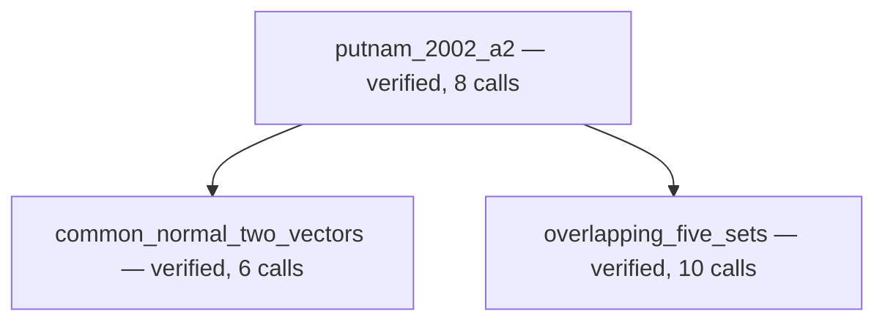

# Independent live prover experiments — 6 September 2026

Two declarations from `testdata/workflow_projects/ProveDemo/ProveDemo/IMOMath3.lean`
were extracted into separate Lean projects and run through the production
`leanflow workflow prove` CLI. Each input contained only the original imports,
open commands, problem comment, exact declaration, and its `sorry`. No sibling
proofs or proof hints were supplied. Difficulty labels are estimates.

The runs started from `milikic/prover-redesign` at `7ce549a`. Source fixes developed
while observing them were not hot-patched into their running processes. Each
project had separate source, scratch, workflow state, and build output, sharing
only the existing dependency cache. The original `IMOMath3.lean` SHA-256 was
`1bf1a7401d081c4fb223d7d8d19df9371e7c37195a03fab961e78956645cd792`.

Both runs used the configured `openai-codex` provider, `gpt-6-astra`, and `xhigh`
reasoning, with clean-room retrieval enabled. Monetary cost was unavailable from
the provider and is reported as unknown. Input token totals include repeated
request context. Call counts describe the LeanFlow campaigns; development and
external code-review calls are separate.

| Problem | Mode | Prover job calls | Campaign calls | Wall limit |
| --- | --- | ---: | ---: | ---: |
| `putnam_2003_b4` — quartic roots and rationality | standard | 60 | 80 | 20 minutes |
| `putnam_2002_a2` — five sphere points in a closed hemisphere | research, two workers | 40 | 120 | 30 minutes |

Planning/review jobs were limited to **12 calls**, below the shipped default of
40. Both runs allowed two direction refinements and used bottom-up scheduling.
The standard run allowed no restart; research allowed one. These are small,
bounded behavior tests, not a representative performance benchmark.

## Medium result

`putnam_2003_b4` completed in **8 API calls and 425.526 campaign seconds**
(426.34 seconds including the CLI wrapper). Usage was 61,685 input and 3,253
output tokens. The prover made three Lean/project searches and two Lean checks,
with no repeated exact search. It corrected its first proof's algebra/cast
errors and submitted an accepted replacement.

Both independent proof checks preserved the original kernel type and reported
exactly `propext`, `Classical.choice`, and `Quot.sound`. Final Lake verification
passed. The canonical file changed only at the authorized literal hole. The
original source remained unchanged, and admitted-call ledgers matched the eight
recorded API requests with all reservations released.

Startup consumed **86.1 seconds before the first request**, caused by eager
local Loogle initialization through the legacy tool registry import. The
observed Loogle process retained about 6.3 GB of memory. Later independent
submission and controller checks took about 79 and 31 seconds respectively;
these were active verification, not stalled model work.

## Research observations

`putnam_2002_a2` completed in **71 API calls and 1,739.846 campaign seconds**
(1,740.58 seconds including the CLI wrapper, about 29 minutes). Usage was 642,580
input and 43,528 output tokens. All three DAG nodes were independently accepted,
and final Lake verification passed. The call ledgers matched all 71 admissions;
the campaign released every reservation and used no direction refinements.

The informal outline used a common nonzero normal to two vectors, followed by
finite inclusion-exclusion. The proposed graph had two independent helpers and
the original theorem as their dependent root. The accepted graph preserved all
original hypotheses, including sphere assumptions unused by this argument.

Planning and semantic review consumed **47 calls** before proof dispatch. The
live trace exposed four specific sources of overhead:

1. Fresh jobs received private earlier-job paths without read access or a usable
   resource catalog. One handoff incurred six avoidable path/access errors, then
   downloaded the same two references again. Later stages repeated that pattern.
2. A planner saved a usable `graph_proposal.json`, but used its last call to edit
   notes. Its empty final response was rejected, causing another planning job.
3. A later proposal included `open scoped` before a helper declaration. The
   strict one-declaration gate correctly rejected it, but its contract had not
   stated that restriction clearly.
4. The next planner received only the rejection text, without the rejected
   proposal it needed to repair.

The two helper prover jobs ran concurrently after independent skeleton checks.
The common-normal helper completed in six calls. The counting helper completed
in ten, including repair of a submitted proof's indentation after the independent
gate rejected it. The final root proof took eight calls and three scratch checks.
No invalid proof gained trusted status. Overall, 47 of the 71 calls went to
planning/review and 24 went to the three prover jobs.

Arrows indicate prerequisites. This run confirms actual parallel helper proving,
independent acceptance, and final assembly. It also demonstrates excessive
planning overhead under the selected 12-call stage allocation. It does not
establish that the shipped 40-call allocation or either scheduling order is best.

## Fixes and verification

- Defer eager legacy MCP discovery during the dedicated prover adapter import;
  explicit later Lean-service discovery remains available. This removes the
  unconditional startup cost, not every possible cost of requested search.
- Give fresh stages a bounded, deduplicated inventory of exact downloaded
  resources with private fetch receipts, verified hashes, and read access. Running provers also receive
  resource grants from completed child research jobs. Private notes, scratch
  proofs, and controller files remain inaccessible to other jobs. File tools
  cannot modify downloads; hashing per inventory is limited to 32 MiB. Old
  downloads lacking private receipts require a fresh fetch before sharing.
- Clarify workspace-relative paths, project source paths, and basename-only
  download filenames. Reuse a matching saved URL instead of downloading again.
- Reserve the last existing non-proving job call for its final report, disabling
  new tool calls without adding requests or resetting budgets. Provider requests
  retain the schemas associated with their historical tool exchanges.
- Pass rejected proposals and gate feedback together to the next fresh planner,
  and specify the helper declaration format explicitly.

Characterization tests reproduced the missing handoff and final-report failures
before each fix. Regression coverage includes real HTTP/provider-adapter payloads,
all three provider modes, fixed request ledgers, concurrent adapter imports,
resource provenance and isolation, child-job handoffs, and all planning gates.
The final quality gate passed with **7,059 tests passed, 109 skipped** in 38.23
seconds. Formatting, Ruff, and mypy were clean. The 14 warnings were the existing
event-loop deprecation. An earlier parallel run exposed a separate lifecycle
test reading state before its background callback finished. That test now runs
its scheduling boundary synchronously, preserving its PID-release and launch
assertions; seven separate tests continue to exercise real asynchronous behavior.
No legacy production code changed. Both the failed log and diagnosis are retained.
CLI and installed-wrapper help checks also passed against the redesign source.

Claude Code (`claude-opus-5[1m]`, configured defaults) independently reviewed the
changes. Its first review identified an Anthropic tool-history compatibility
issue and forgeable download metadata in the initial fixes. Both were corrected:
reporting now uses the provider's explicit no-tool choice, and downloaded content
requires a receipt outside the writable job workspace. The Anthropic no-tool
choice is supported with thinking enabled, as documented in the
[official thinking guide](https://platform.claude.com/docs/en/build-with-claude/extended-thinking).
The provider regressions use actual SDKs with local validating HTTP endpoints;
they do not constitute a live Anthropic-backend run.

The review's lower-priority hashing concern was addressed with the 32 MiB cap.
Claude's focused follow-up marked both material findings and the hashing cap
resolved. Its additional oversized-receipt observation was reproduced and fixed
with a regression that preserves previously downloaded evidence. Symlinked
internal state paths remain rejected rather than gaining implicit read authority.
Temporary MCP import suppression remains confined to the dedicated prover
process, and the once-only child research marker remains a crash-safe attempt
reservation. No cross-workflow startup policy was changed.

Artifacts are retained locally under
`/Users/lmilikic/Desktop/LeanFlow-prover-experiments/20260906-102515-independent/`:
the manifest and exact inputs, production launch script and consoles, observation
snapshots, call-ledger summaries, proof files, and independent verification logs.
The fixes have regression coverage; these original live runs do not measure their
end-to-end performance improvement.
